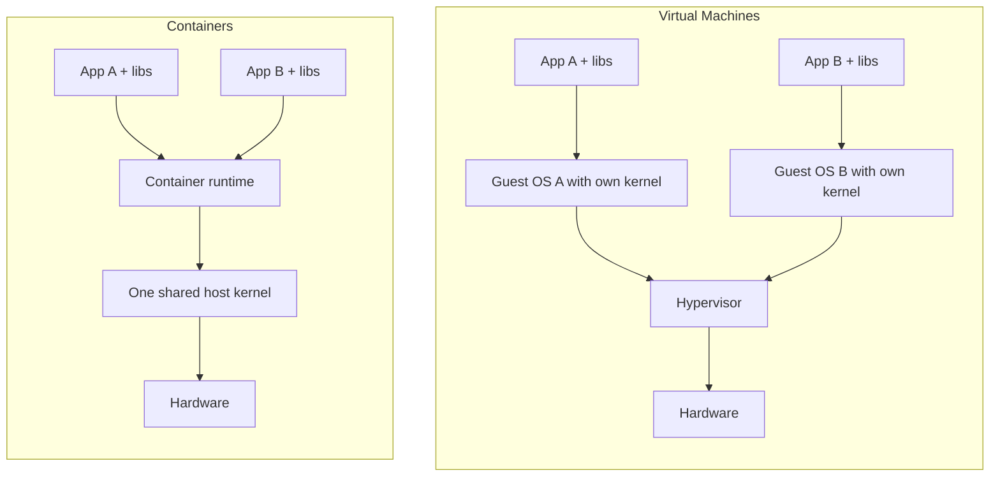
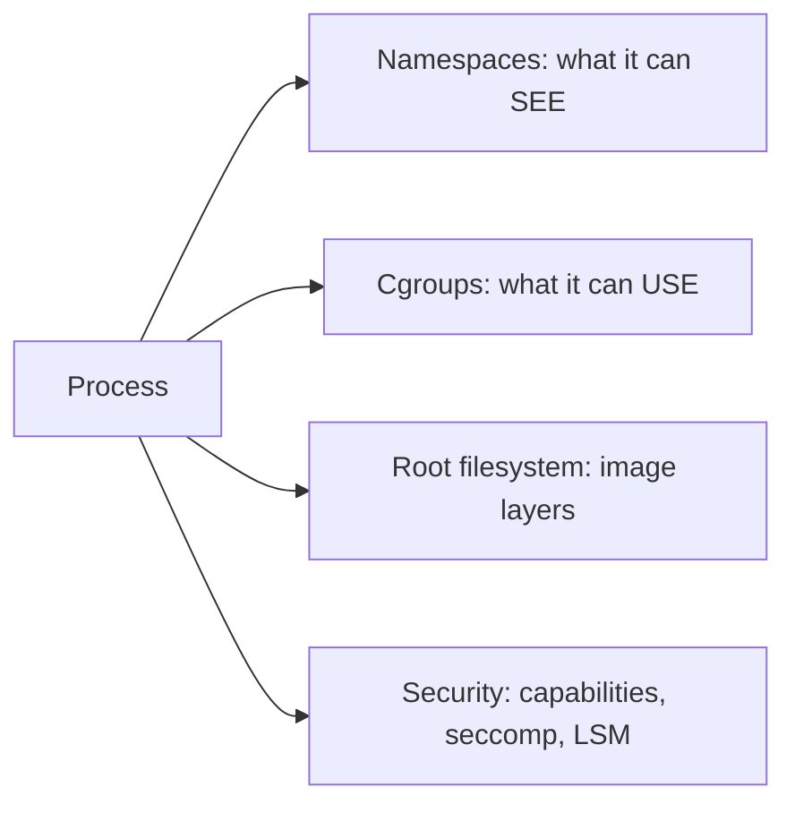
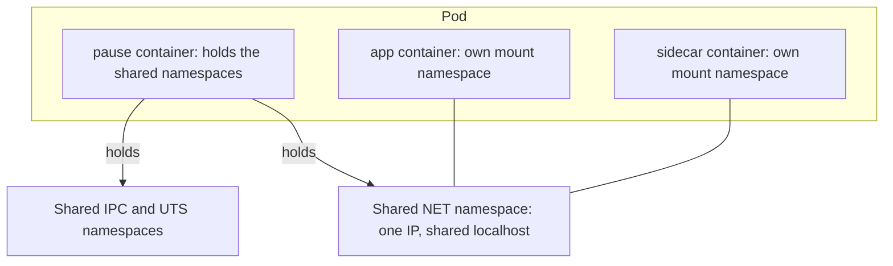
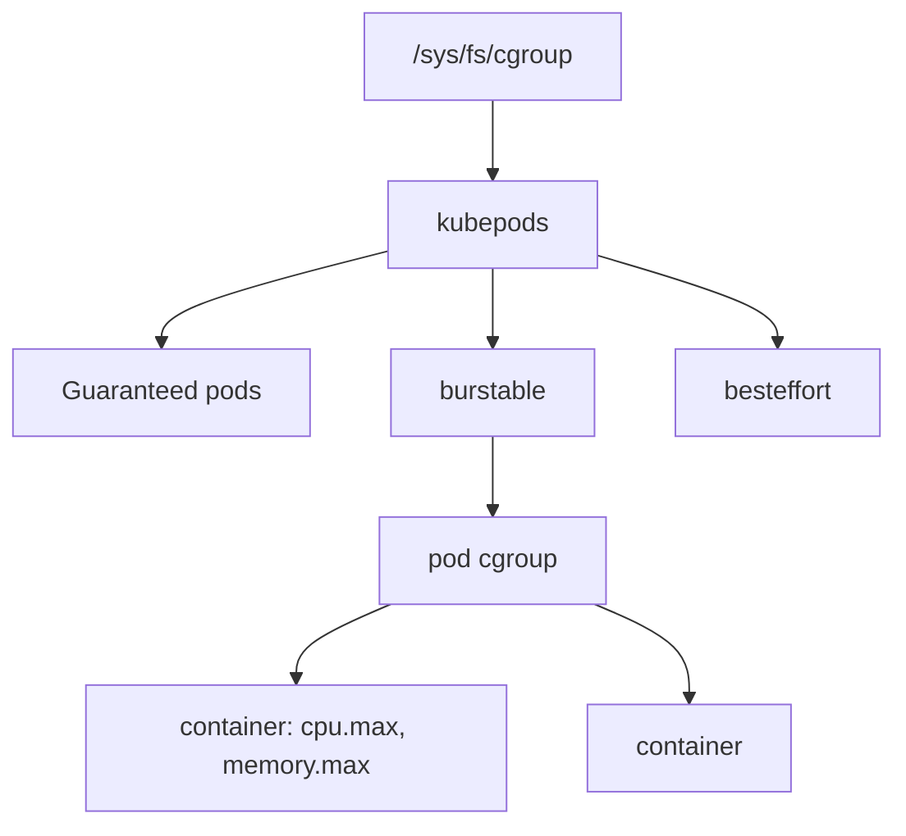
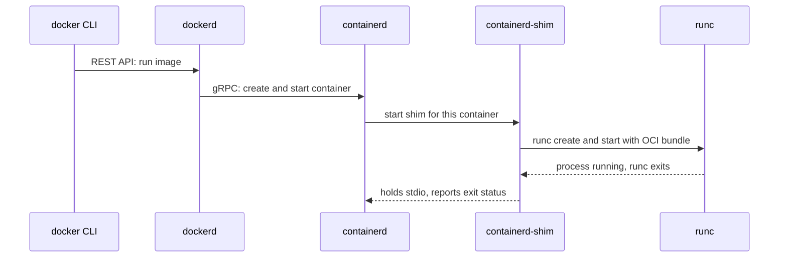
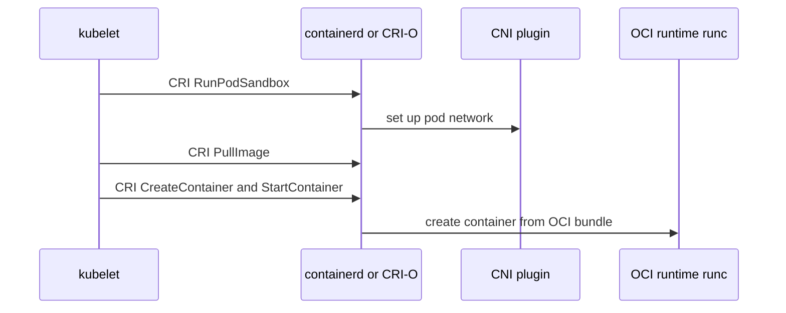

# Docker Handbook — Part 1: Container Foundations

# Chapter 1 — Containers vs Virtual Machines

## 1.1 Why it exists

Every later topic in this handbook (images, resource limits, networking, security) is a consequence of one fact:

> **A container is an ordinary Linux process, isolated and resource-limited by the kernel, running on a kernel it shares with every other container on the host.**

If you remember only that, you can derive most container behavior in interviews.

| Era | Unit of deployment | Problem solved | New problem created |
|---|---|---|---|
| Bare metal | Physical server | Full hardware performance | Very low utilization, slow provisioning, dependency conflicts between apps |
| Virtual machines | VM image | Consolidation, strong isolation, snapshots | GB-sized images, minutes to boot, a full OS to patch per app |
| Containers | Image + process | Fast start, high density, identical artifact from laptop to prod | Weaker isolation boundary, needs orchestration at scale |
| Orchestrated containers | Pod / Deployment | Scheduling, self-healing, scaling | Operational complexity (this is Kubernetes) |

Containers won because they made the **deployable artifact immutable and portable** (build once, run anywhere), and because start-up in milliseconds and high density made microservices and CI/CD economical.

## 1.2 How it works

**Analogy:** VMs are separate houses, each with its own foundation and plumbing. Containers are apartments in one building: shared plumbing (the kernel), but each has a locked door and its own meter (namespaces and cgroups).



### A container is a process plus four restrictions



You can prove this on any Docker host:

```bash
docker run -d --name web nginx
ps aux | grep "nginx: master"     # visible as a normal host process
docker inspect -f '{{.State.Pid}}' web
```

### VM vs container at a glance

| Aspect | Virtual Machine | Container |
|---|---|---|
| Isolation boundary | Hypervisor (hardware-level) | Kernel features (namespaces, cgroups) |
| Kernel | Own per VM | Shared with host |
| Start time | Tens of seconds to minutes | Milliseconds to seconds |
| Image size | GBs | MBs to low hundreds of MBs |
| Density per host | Tens | Hundreds |
| Can run a different OS kernel | Yes | No (Linux containers need a Linux kernel) |
| Blast radius of a kernel exploit | One VM | Potentially the whole host |

## 1.3 Kubernetes relationship

- Kubernetes **nodes are usually VMs**, so in production you typically have containers running inside VMs. You get VM-level isolation between nodes and container-level efficiency within them.
- A pod cannot have its own kernel. Node kernel version and node-level settings affect every pod on that node.
- When stronger isolation is required (untrusted workloads), sandboxed runtimes such as gVisor or Kata Containers can be selected per pod with a `RuntimeClass`.

## 1.4 How it breaks in production

- **Kernel dependency:** an app needing a specific kernel module or newer kernel feature fails, because the container uses the node's kernel.
- **Treating containers like VMs:** SSH-ing in, running systemd, patching in place, or running many processes per container. Changes vanish when the container is replaced.
- **No limits set:** one container starves its neighbors (noisy neighbor). See Chapter 3.
- **Architecture mismatch:** an image built for `arm64` run on `amd64` fails with `exec format error`. This is common when building on Apple Silicon laptops and deploying to x86 nodes.

> **Common Pitfall:** "Containers are lightweight VMs." They are not. There is no guest OS, and no hypervisor boundary.

## 1.5 Interview perspective

1. **What is a container, technically?** A process (or process tree) isolated with namespaces, limited with cgroups, and given its own root filesystem from an image.
2. **Why are containers faster to start than VMs?** No guest OS boot. The kernel is already running, and starting a container is just creating a process with isolation settings.
3. **Are containers less secure than VMs?** The isolation boundary is weaker because the kernel is shared. Mitigate with non-root users, dropped capabilities, seccomp, and sandboxed runtimes for untrusted code (Chapter 15).
4. **Can a Windows container run on a Linux host?** No. Containers share the host kernel, so the container OS family must match the host kernel.
5. **If nodes are VMs, why use containers at all?** Packaging consistency, density, fast deploys, and rollback. The VM is infrastructure; the container is the application unit.

> **Interview Tip:** Lead with "a container is just a process with isolation." It shows you understand internals rather than marketing.

---

# Chapter 2 — Namespaces

## 2.1 Why it exists

Namespaces answer: **what can this process see?** Without them, every process sees every other process, the whole network stack, and the whole filesystem. A namespace gives a process its own private view of one kind of system resource.

## 2.2 How it works

Namespaces are a kernel feature, created with the `clone()` or `unshare()` system calls and joined with `setns()`. Every process has a link to each of its namespaces in `/proc/<pid>/ns/`.

| Namespace | Isolates | What the container sees |
|---|---|---|
| **PID** | Process IDs | Its own process tree; main process is PID 1 |
| **NET** | Network stack | Own interfaces, IP, routing table, iptables |
| **MNT** | Mount points | Own filesystem view (the image's rootfs) |
| **UTS** | Hostname | Own hostname |
| **IPC** | Shared memory, message queues | Own IPC objects (including `/dev/shm`) |
| **USER** | UID/GID mappings | UID 0 inside can map to an unprivileged UID outside |
| **CGROUP** | Cgroup view | Sees its own cgroup as the root |

### Try it yourself

```bash
# New PID + mount namespace: ps only sees the new tree
sudo unshare --pid --fork --mount-proc bash
ps aux                           # PID 1 is bash

# On the host: list namespaces and enter a container's network namespace
lsns
PID=$(docker inspect -f '{{.State.Pid}}' web)
sudo nsenter -t $PID -n ip addr  # container's network view, host's tools
```

### PID namespace

The same process has two PIDs: PID 1 inside the container, and a normal PID on the host. Two details matter in production:

- The first process in a PID namespace is **PID 1** and gets special signal handling: signals with default actions (like SIGTERM) are **ignored unless the process installed a handler**. This is why some containers do not stop gracefully (covered in Chapter 11).
- When PID 1 exits, the kernel kills every other process in that namespace.

### Network namespace

Each network namespace has its own interfaces, routes, and firewall rules. A container's network namespace is connected to the host through a **veth pair** (a virtual cable with one end in each namespace). Details in Chapter 14.

### Mount namespace

Gives the container its own mount table. The runtime builds the root filesystem from image layers, then switches the process into it with `pivot_root`. This is why a container cannot see host files unless you mount them in.

### User namespace

Maps container UIDs to different host UIDs, so root inside can be an unprivileged user outside. **By default Docker does not remap users**: root in the container is root (UID 0) on the host, constrained by capabilities. User namespaces power rootless containers and are a defense-in-depth measure.

### IPC and UTS namespaces

IPC isolates SysV IPC and POSIX message queues. UTS gives each container its own hostname. Both are simple, but IPC sharing matters for pods (below).

## 2.3 Kubernetes relationship

A **pod** is a group of containers sharing some namespaces.



| Pod setting | Effect | Risk |
|---|---|---|
| Default | Containers share NET, IPC, UTS; separate PID and MNT | None, this is the model |
| `shareProcessNamespace: true` | Containers see each other's processes (useful for debug sidecars) | Weaker isolation between containers |
| `hostNetwork: true` | Pod uses the node's network namespace | Port conflicts, bypasses network policy |
| `hostPID: true` / `hostIPC: true` | Pod sees node processes / IPC | Serious security exposure |
| `hostUsers: false` | Pod uses a user namespace (on versions that support it) | Reduces impact of container root |

Because containers in a pod share a network namespace, they talk over `localhost`. The hidden **pause** container exists to own those namespaces, so they survive app container restarts.

## 2.4 How it breaks in production

- **Can't debug a minimal image:** distroless images have no shell. Use `kubectl debug` with an ephemeral container, or `nsenter` from the node, to borrow the container's namespaces with your own tools.
- **Sidecar can't see the app's processes:** by default PID namespaces are separate. Needs `shareProcessNamespace: true`.
- **Port already in use:** a pod with `hostNetwork: true` collides with a node service or another pod.
- **Container ignores `docker stop` / pod termination:** PID 1 has no SIGTERM handler, so the kubelet waits out the grace period and then sends SIGKILL.
- **Security review failure:** privileged, `hostPID`, or `hostNetwork` pods are usually flagged.

> **Production Insight:** When you cannot `exec` into something, enter its namespaces instead: `nsenter -t <pid> -n -m` from the node, or `kubectl debug -it <pod> --image=<tools> --target=<container>`.

## 2.5 Interview perspective

1. **Which namespaces does Docker use?** PID, NET, MNT, UTS, IPC, and optionally USER and CGROUP.
2. **How do containers in one pod communicate?** They share a network namespace, so they use `localhost`. They can also share volumes.
3. **What is the pause container?** A tiny container that holds the pod's shared namespaces so they outlive individual app containers.
4. **Is root in a container the same as root on the host?** By default, yes (same UID 0), restricted by capabilities, seccomp, and LSMs. With user namespaces it maps to an unprivileged host UID.
5. **How would you inspect a container that has no shell?** Ephemeral debug container or `nsenter` into its namespaces.

> **Interview Tip:** Namespaces limit what you *see*; cgroups limit what you *use*. Interviewers like hearing this contrast stated cleanly.

---

# Chapter 3 — Cgroups

## 3.1 Why it exists

Namespaces give isolation of **view**, but not of **consumption**. Without cgroups, one container could use all CPU and memory on the node. Control groups (cgroups) **account for and limit** resources for a group of processes: CPU, memory, I/O, and process count.

## 3.2 How it works

Cgroups are a hierarchy exposed as a filesystem under `/sys/fs/cgroup`. Writing a value to a file sets a limit; the kernel enforces it.

| | cgroup v1 | cgroup v2 |
|---|---|---|
| Hierarchy | One tree per controller | Single unified tree |
| CPU/memory files | `cpu.shares`, `cpu.cfs_quota_us`, `memory.limit_in_bytes` | `cpu.weight`, `cpu.max`, `memory.max` |
| Status | Legacy | Default on modern distributions |

Check which you have: `stat -fc %T /sys/fs/cgroup` prints `cgroup2fs` for v2.

### The key mapping: Docker flag to cgroup file to Kubernetes field

| Resource | Docker flag | cgroup v2 file | Kubernetes field |
|---|---|---|---|
| CPU hard cap | `--cpus=0.5` | `cpu.max` | `resources.limits.cpu` |
| CPU relative weight | `--cpu-shares` | `cpu.weight` | `resources.requests.cpu` |
| Memory hard cap | `-m 256m` | `memory.max` | `resources.limits.memory` |
| Process count | `--pids-limit` | `pids.max` | kubelet `podPidsLimit` |
| Disk I/O | `--device-write-bps` | `io.max` | No native pod field |

### CPU: shares vs quota

These are two different mechanisms, and confusing them is the most common cgroup mistake.

- **CPU shares (weight)** are *relative*. They matter only when CPUs are contended. Two containers with weights 1024 and 512 split a busy CPU 2:1. If the CPU is idle, either can use all of it. Kubernetes **requests** become shares: roughly 1000m ≈ 1024 shares.
- **CPU quota** is an *absolute cap* per scheduling period (default 100 ms). `--cpus=0.5` becomes `cpu.max = 50000 100000`: at most 50 ms of CPU time every 100 ms. Kubernetes **limits** become quota.

When a container uses its quota before the period ends, the kernel **throttles** it (pauses it) until the next period. This happens even if the node has idle CPU.

```
Limit 500m on a 4-thread app, period = 100 ms, quota = 50 ms

|0ms ---- 12ms|---------- throttled ----------|100ms
 4 threads burn   remaining ~88 ms: all threads
 50 ms of CPU     paused, requests stall
 in ~12 ms        => latency spike, CPU graph looks low
```

### Memory: a hard wall

`memory.max` is a hard limit. If the container's memory cannot be reclaimed (page cache is reclaimable, heap is not) and it hits the limit, the kernel's **OOM killer** kills a process in that cgroup with SIGKILL. The container exits with **code 137** (128 + 9). Kubernetes reports `OOMKilled`.

Memory **requests** are not a cgroup cap. They are used by the scheduler for placement and by the kubelet to rank pods for eviction.

### Hierarchy in Kubernetes



Pod **QoS class** (derived from requests and limits) decides eviction order under node pressure:

| QoS | Condition | Evicted |
|---|---|---|
| Guaranteed | requests = limits for CPU and memory in every container | Last |
| Burstable | At least one request or limit set | Middle |
| BestEffort | Nothing set | First |

## 3.3 Kubernetes relationship

The kubelet translates pod `resources` into cgroup settings via the runtime. Everything in the table above is what makes `kubectl describe pod` limits real. Two related Kubernetes behaviors:

- **Node pressure eviction** (kubelet removes pods when the node is short on memory/disk) is different from **cgroup OOM kill** (kernel kills a container that hit its own limit).
- **Runtime awareness:** Java is container-aware by default in modern versions. Go has historically ignored CPU quota when sizing `GOMAXPROCS` (use `automaxprocs` or a recent Go release), which can cause heavy throttling.

## 3.4 How it breaks in production

### Troubleshooting example A: latency spikes while CPU looks idle

**Symptom:** p99 latency spikes. Dashboards show 20 to 30% CPU usage versus the limit.

```bash
# Inside the container (cgroup v2)
cat /sys/fs/cgroup/cpu.stat
# nr_periods 12000
# nr_throttled 4300          <- throttled in ~36% of periods
# throttled_usec 91000000
```

**Diagnosis:** the limit is too tight for a bursty, multi-threaded app. Average usage hides burst demand inside each 100 ms period.
**Fixes:** raise or remove the CPU limit (keep the request), reduce thread count, or set runtime parallelism to match the limit.

### Troubleshooting example B: OOMKilled

```bash
kubectl describe pod <pod> | grep -A5 "Last State"
#   Last State: Terminated
#   Reason:     OOMKilled
#   Exit Code:  137
```

**Diagnosis flow:** was it the container limit (`OOMKilled` on the container) or node pressure (pod `Evicted`)? Compare working-set memory (`kubectl top pod`) against the limit, and check for leaks or JVM heap sized larger than the limit.
**Fixes:** raise the limit, size the app heap to roughly 70 to 75% of the limit, fix leaks.

> **Production Insight:** CPU is *compressible* (you get throttled, not killed). Memory is *incompressible* (you get killed). Treat their limit policies differently: many teams set memory requests = limits, and set CPU requests without a tight limit.

> **Common Pitfall:** Setting requests much lower than real usage. The scheduler overpacks nodes, and the pod gets throttled or evicted when neighbors get busy.

## 3.5 Interview perspective

1. **Request vs limit?** Request is the scheduling guarantee (and CPU weight under contention); limit is the enforced ceiling (CPU quota, memory hard cap).
2. **Why is my app slow when CPU usage is low?** CFS quota throttling. Check `nr_throttled` in `cpu.stat`.
3. **What does exit code 137 mean?** SIGKILL (128 + 9), most commonly the OOM killer; confirm with `OOMKilled`.
4. **OOMKilled vs Evicted?** OOMKilled: container hit its own memory limit. Evicted: kubelet removed the pod due to node pressure.
5. **cgroup v1 vs v2?** v2 has one unified hierarchy, better accounting, and is the modern default; file names differ.

---

# Chapter 4 — The Runtime Stack: Docker, containerd, runc, OCI, CRI

## 4.1 Why it exists

Early Docker was one monolithic daemon. As Kubernetes and other tools needed the same container machinery, the industry split it into **standardized, replaceable layers**, so that tooling can evolve independently.

| Component | Role |
|---|---|
| **Docker CLI / dockerd** | User-facing tool: build, networking, volumes, REST API |
| **containerd** | Container lifecycle manager: images, snapshots, starts containers |
| **containerd-shim** | Per-container supervisor; keeps the container alive and reports exit status |
| **runc** | Low-level OCI runtime: sets up namespaces, cgroups, then executes the process |
| **CRI-O** | A runtime built *only* to serve Kubernetes (CRI), using OCI runtimes underneath |

## 4.2 How it works

### The standards

- **OCI (Open Container Initiative)** defines three specs: the **image spec** (how images are packaged), the **runtime spec** (how to run a container from a bundle of `config.json` plus rootfs), and the **distribution spec** (how registries serve images).
- **CRI (Container Runtime Interface)** is a gRPC API the kubelet uses to talk to a runtime: one service for runtime operations (sandbox and container lifecycle), one for images.

OCI standardizes *the artifact and the low-level run*; CRI standardizes *how Kubernetes calls a runtime*.

### What `docker run` does



**Why the shim?** runc exits after starting the process. The shim stays as the container's parent, so the container survives a containerd or Docker daemon restart and exit codes are still collected.

**What runc does:** reads the OCI bundle, creates the namespaces, applies cgroup limits, mounts the rootfs and switches into it, drops capabilities and applies seccomp, then `exec`s your process.

### What Kubernetes does



Docker Engine is **not** in this path.

## 4.3 Kubernetes relationship

- **dockershim was removed in Kubernetes 1.24.** The kubelet previously had built-in glue to talk to Docker. Now it talks CRI directly to containerd or CRI-O.
- **Your images still work.** Images built with `docker build` are OCI-compatible. Only the *runtime on the node* changed.
- **containerd** is a general-purpose runtime with a built-in CRI plugin; **CRI-O** is purpose-built for Kubernetes. Both end at an OCI runtime (usually runc). Functionally the cluster behaves the same.
- Alternative OCI runtimes (gVisor, Kata) plug in at the same layer and are selected with `RuntimeClass`.

| Task | On a Docker host | On a Kubernetes node |
|---|---|---|
| List containers | `docker ps` | `crictl ps` |
| List images | `docker images` | `crictl images` |
| Logs | `docker logs` | `crictl logs` |
| Low-level containerd | n/a | `ctr -n k8s.io containers ls` |

## 4.4 How it breaks in production

- **"`docker ps` shows nothing on the node."** Kubernetes workloads are not managed by Docker. Use `crictl`. Note: containerd's own *namespaces* (`k8s.io` for Kubernetes, `moby` for Docker) are unrelated to Linux namespaces.
- **Pods mounting `/var/run/docker.sock` break** after the move to containerd, since there is no Docker daemon on the node. Build-in-cluster pipelines should use daemonless builders (Chapter 17).
- **Node disk fills up:** runtime image store and container logs grow. Kubelet image garbage collection and log rotation settings matter.
- **Runtime socket unhealthy:** the node goes `NotReady`; check the runtime service (`systemctl status containerd`) and kubelet logs.
- **Pull or sandbox creation failures:** often CNI problems (`failed to create pod sandbox`), not application bugs.

> **Production Insight:** When a node misbehaves, debug in order: kubelet logs → runtime (`crictl`, containerd logs) → runc/kernel messages (`dmesg` for OOM and cgroup events).

> **Common Pitfall:** Saying "Kubernetes dropped Docker support, so Docker images don't work." Wrong. Docker the *runtime shim* was dropped; Docker-built images are unaffected.

## 4.5 Interview perspective

1. **What is runc?** The reference OCI runtime. It creates namespaces and cgroups and executes the container process, then exits.
2. **containerd vs Docker?** Docker is a full developer platform (CLI, build, networking, API) that delegates container execution to containerd. Kubernetes needs only containerd (or CRI-O).
3. **What is CRI, and what is OCI?** CRI: kubelet-to-runtime gRPC API. OCI: open specs for image format, runtime, and distribution.
4. **Why was dockershim removed?** It was a maintenance burden: an in-tree adapter for a runtime that already sat on top of containerd, which Kubernetes could call directly.
5. **How do you debug containers on a node without Docker?** `crictl ps/logs/inspect`, and `ctr -n k8s.io` for lower-level views.

> **Interview Tip:** Be able to draw the chain from memory: `kubelet → CRI → containerd/CRI-O → shim → runc → process`. It is among the most common senior-level whiteboard questions.

---

# Part 1 in 60 Seconds

- A container = **process + namespaces (see) + cgroups (use) + rootfs + security filters**.
- It shares the host kernel, so isolation is weaker than a VM's, and the kernel matters.
- Requests schedule and weigh CPU; limits enforce. CPU limits throttle; memory limits kill (exit 137).
- Runtime chain: `kubelet → CRI → containerd/CRI-O → shim → runc`. Docker Engine is not on the node's runtime path.
- Debug by borrowing namespaces: `nsenter`, ephemeral containers, `crictl`.

