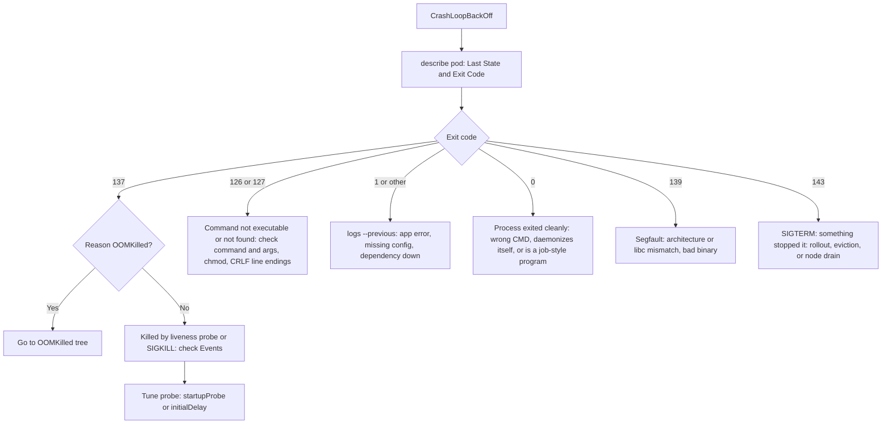
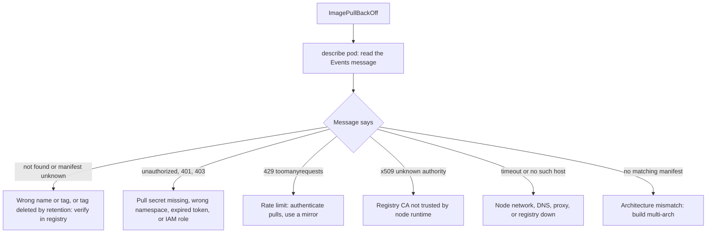
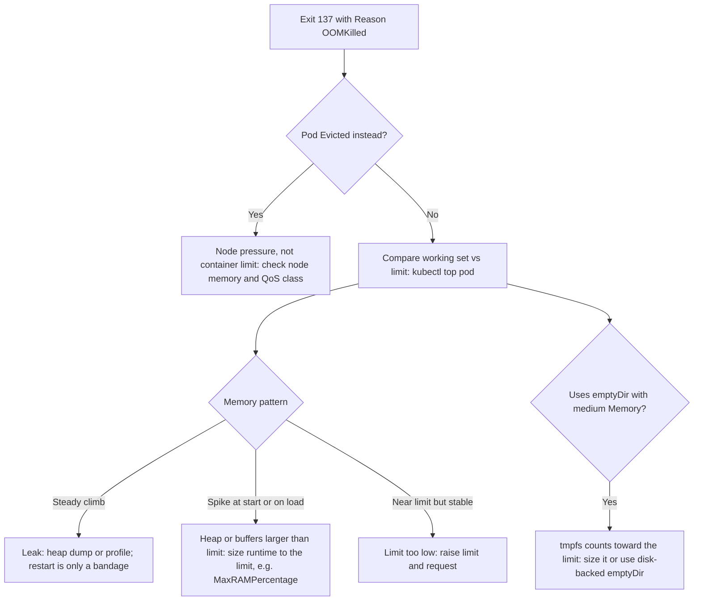
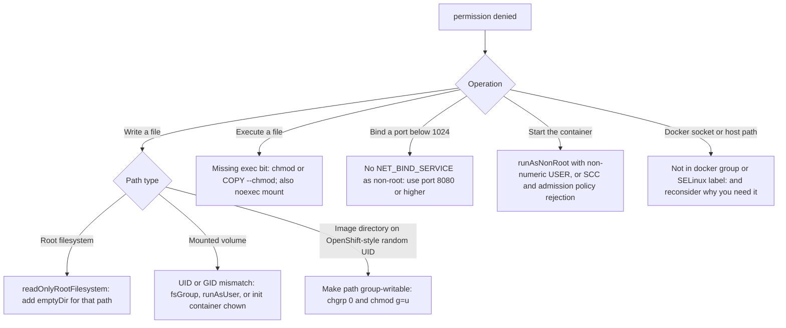
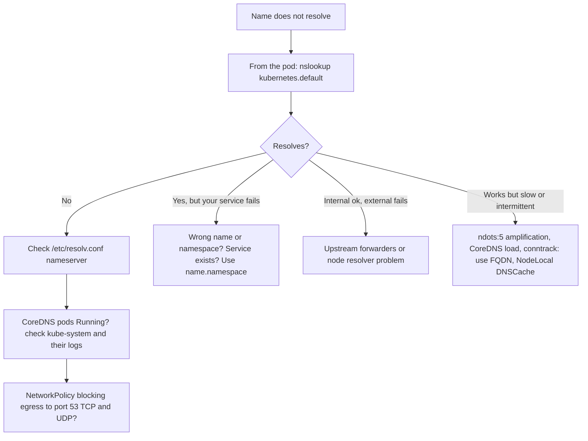
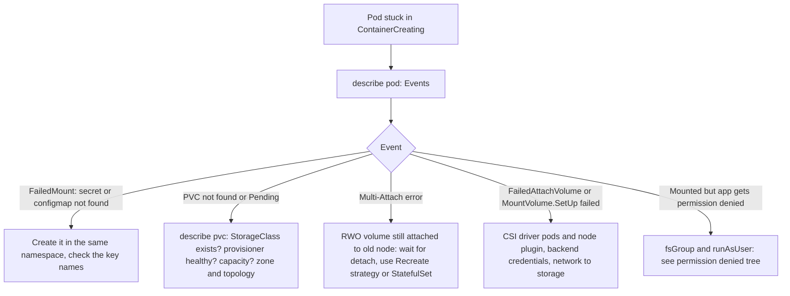

# Docker Handbook — Part 10: Troubleshooting and Interview

# Chapter 19 — Troubleshooting Playbook

## 19.1 Why you need this

In an incident or an interview, nobody asks you to recite theory. They give you a symptom and watch **how you narrow it down**. The method below is the same for every failure: **read the status, read the events, read the logs, then test the hypothesis**.

## 19.2 The universal first five commands

```bash
kubectl get pod <p> -o wide                        # status, node, restarts, IP
kubectl describe pod <p>                           # Events (bottom), Last State, Exit Code, Reason
kubectl logs <p> -c <container> --previous         # logs of the crashed instance
kubectl get events --sort-by=.lastTimestamp        # cluster-side story
kubectl debug -it <p> --image=<tools-image> --target=<container>   # borrow namespaces (Chapter 2)
```

| Status you see | Meaning | Go to |
|---|---|---|
| `ImagePullBackOff` / `ErrImagePull` | Node cannot pull the image | 19.4 |
| `CrashLoopBackOff` | Container keeps exiting; kubelet backs off (up to ~5 min) | 19.3 |
| `OOMKilled` (in Last State) | Container hit its memory limit | 19.5 |
| `ContainerCreating` for a long time | Sandbox, CNI, or **volume mount** problem | 19.8 |
| `CreateContainerConfigError` | Bad config: missing Secret/ConfigMap key, non-numeric user | Ch 10 |
| `Pending` | Not scheduled: resources, taints, PVC unbound | Ch 13 |
| `Running` but not working | Probes, endpoints, DNS, permissions | 19.6, 19.7 |

---

## 19.3 CrashLoopBackOff



**Fast facts:** the backoff delay doubles from 10 s up to about 5 minutes. A crash that occurs **before** any log line usually means a bad entrypoint (Chapter 11). Exit codes are decoded in Chapter 5 and the cheat sheet.

## 19.4 ImagePullBackOff



**Verify independently:** from the affected node, `crictl pull <image>` reproduces the problem outside Kubernetes. Locally, `docker pull <image>` separates "image problem" from "cluster problem". Details and fixes: Chapter 16.

## 19.5 OOMKilled



Confirm with `kubectl describe pod` (Reason and Exit Code) and, on the node, `dmesg | grep -i oom`. Mechanics: Chapter 3.

## 19.6 Permission denied

First answer: **what operation failed?** The fix depends entirely on that.



**Diagnose in place:**

```bash
kubectl exec <p> -- id                      # who am I?
kubectl exec <p> -- ls -ld /path            # who owns the target?
kubectl exec <p> -- sh -c 'mount | grep -E "ro,|noexec"'
```

Background: Chapters 13 and 15.

## 19.7 DNS resolution failure



```bash
kubectl exec -it <p> -- sh -c 'cat /etc/resolv.conf; nslookup my-svc'
kubectl -n kube-system get pods -l k8s-app=kube-dns
kubectl -n kube-system logs -l k8s-app=kube-dns --tail=50
```

No `nslookup` in the image? Use an ephemeral container or a throwaway debug pod with network tools. In plain Docker, remember: the **default bridge has no name resolution** (Chapter 14).

## 19.8 Storage mount failure



Details: Chapter 13.

## 19.9 Interview perspective

1. **A pod is in CrashLoopBackOff. Walk me through it.** `describe` for exit code and Last State, `logs --previous`, then branch by code (137 memory/probe, 126/127 command, 1 app error, 0 wrong CMD), and check probes and dependencies.
2. **How do you debug a pod with no shell?** Ephemeral debug container with `--target`, or `nsenter` from the node (Chapter 2).
3. **What is your general approach to Kubernetes incidents?** Status, then Events, then logs, then hypothesis test; change one variable at a time, and check recent deploys and config changes first.

> **Interview Tip:** Say the order out loud: *"status, events, logs, then I reproduce outside the cluster."* A visible method matters more than the specific fix.

---

# Chapter 20 — Cross-cutting Interview Bank

*Per-chapter questions are not repeated here. These are the scenario and end-to-end questions that combine topics.*

## 20.1 Scenario questions

**1. Walk me through everything that happens from `git push` to a running pod.**
CI lints, builds with BuildKit, tests, scans, generates an SBOM, signs, and pushes an immutable tag (Chapters 8, 15, 17). The deployment manifest is updated with the image **digest** (GitOps). The API server stores it, controllers create pods, the scheduler places them, and the kubelet calls containerd via CRI to pull layers, create the sandbox and network (CNI), mount volumes (CSI), and start the process with runc (Chapters 4, 18).

**2. It works in Docker but fails in Kubernetes. What differs?**
Non-numeric `USER` with `runAsNonRoot`, `securityContext` or Pod Security restrictions, no Service so nothing is reachable, `HEALTHCHECK` ignored so probes are missing, resource limits (OOM or throttling), env/ConfigMap differences, read-only root filesystem, DNS names (`db` vs Service DNS), and image architecture.

**3. Rollouts cause a burst of 502s. Why?**
Old pods are killed before they drain: PID 1 ignores SIGTERM (shell-form CMD), no `preStop` delay for load balancer deregistration, readiness not gating new pods, or too-aggressive `maxUnavailable` (Chapters 11, 14). Fix: exec-form entrypoint with SIGTERM handling, readiness probes, a short `preStop` sleep, and a sensible grace period.

**4. How do you achieve zero-downtime deploys?**
Rolling update with `maxUnavailable: 0`, accurate readiness probes, graceful shutdown on SIGTERM, a PodDisruptionBudget for voluntary disruptions, enough replicas, and multi-zone spread.

**5. Latency spikes but CPU usage looks low.**
CFS **CPU throttling** from a tight CPU limit; check `nr_throttled` in `cpu.stat` (Chapter 3). Also check GC pauses, DNS `ndots` amplification, and downstream dependencies.

**6. Nodes repeatedly hit DiskPressure.**
Image layers from many versions, writable-layer and `emptyDir` usage, unrotated container logs, leftover build cache on build nodes, and large images (Chapters 7, 9, 13). Remedies: log rotation, ephemeral-storage limits, image GC thresholds, smaller images, and separate disks for the runtime.

**7. The image is 1.5 GB. What do you do and why does it matter?**
Multi-stage build, minimal base, remove build tooling, cleanup in the same layer, `.dockerignore`. It matters for pull time, autoscaling speed, node disk, and CVE count (Chapters 7, 9).

**8. A pod runs fine on one node but fails on another.**
Architecture mismatch, stale mutable tag cached on one node, different kernel or cgroup version, node disk pressure, node-specific network or CNI problem, missing registry access from one node pool, or taints/SELinux differences.

**9. A pod is stuck in `Terminating`.**
It is waiting for the grace period (process ignoring SIGTERM), a **finalizer** is blocking deletion, a volume cannot unmount, or the node is `NotReady`. Check `describe`, finalizers in the YAML, and node status. Force deletion is a last resort because it can leave resources attached.

**10. How would you secure the container supply chain end to end?**
Minimal pinned base, scan in CI and on a schedule, SBOM, signed images, admission policy verifying signatures and allowed registries, short-lived pipeline credentials, digests in manifests, and a restricted runtime profile (Chapter 15).

**11. `docker ps` shows nothing on a Kubernetes node. Where are my containers?**
The node runs containerd or CRI-O, not Docker. Use `crictl ps` (or `ctr -n k8s.io`) (Chapter 4).

**12. Explain how you would containerize a legacy app for Kubernetes.**
Decide stateless vs stateful; externalize config (env/ConfigMap/Secret) and state (PVC or external service); log to stdout; run as non-root numeric UID; add health endpoints for probes; set requests and limits; handle SIGTERM; build a multi-stage, pinned image; test in CI.

## 20.2 Rapid-fire definitions (one line each)

| Term | One-liner |
|---|---|
| Container | An isolated, resource-limited process on a shared kernel |
| Namespace | Limits what a process **sees** |
| Cgroup | Limits what a process **uses** |
| Image | Manifest + config + immutable layers |
| Layer | Content-addressed tarball of filesystem changes |
| Digest | SHA-256 of content; the immutable identity of an image |
| OverlayFS | Union mount of read-only layers plus one writable layer |
| Copy-on-write | First write copies a file up into the writable layer |
| OCI | Open specs for image, runtime, and distribution |
| runc | Reference OCI runtime that sets up namespaces/cgroups and execs the process |
| containerd | Container lifecycle daemon used by Docker and Kubernetes |
| CRI | kubelet-to-runtime gRPC API |
| CRI-O | Runtime built only for Kubernetes |
| Pod | Shared network/IPC sandbox for one or more containers |
| Service | Stable virtual IP and DNS over ephemeral pods |
| PV / PVC | Storage resource / a pod's claim on it |
| SCC | OpenShift cluster policy controlling pod privileges |
| PID 1 | Special process: no default signal handling, must reap zombies |

> **Interview Tip:** For scenario questions, answer in **layers**: symptom → likely causes ordered by frequency → how you would confirm each → the fix → how you would prevent it. Prevention is what separates senior answers.

---

# Chapter 21 — One-page Cheat Sheet

## 21.1 Mental model

```
Container = process + namespaces (SEE) + cgroups (USE) + rootfs (layers) + security filters
Chain:      kubelet → CRI → containerd/CRI-O → shim → runc → process
Image:      manifest + config + immutable content-addressed layers; tag = mutable, digest = truth
Pod:        shared NET/IPC/UTS sandbox; Deployment keeps it alive; Service gives it an address
```

## 21.2 Exit codes and statuses

| Code | Meaning |
|---|---|
| 0 | Clean exit (is the CMD finishing? wrong command?) |
| 1 | Application error |
| 126 / 127 | Not executable / not found |
| 137 | SIGKILL: OOM or liveness kill |
| 139 | Segfault |
| 143 | SIGTERM: graceful stop |

## 21.3 Resources: Docker, cgroup, Kubernetes

| Docker | cgroup v2 | Kubernetes | Behavior at limit |
|---|---|---|---|
| `--cpus` | `cpu.max` | `limits.cpu` | **Throttled** |
| `--cpu-shares` | `cpu.weight` | `requests.cpu` | Relative share under contention |
| `-m` | `memory.max` | `limits.memory` | **OOM-killed (137)** |
| `--pids-limit` | `pids.max` | `podPidsLimit` | Fork fails |

## 21.4 Docker → Kubernetes in one table

| Docker | Kubernetes |
|---|---|
| `-p` | Service / Ingress |
| `-v name:` | PVC |
| bind mount | `hostPath` (avoid) |
| `--tmpfs` | `emptyDir` (Memory) |
| `-e` / `--env-file` | `env` / ConfigMap / Secret |
| `--restart` | Deployment / controllers |
| HEALTHCHECK | Probes |
| `--user`, `--read-only`, `--cap-drop` | `securityContext` |
| ENTRYPOINT / CMD | `command` / `args` |
| Compose `depends_on` | Readiness + init containers + retries |

## 21.5 Commands

```bash
# Docker
docker ps -a | logs -f | exec -it | inspect | stats | events | history | diff
docker system df  →  docker system prune   (careful with --volumes)

# Kubernetes triage
kubectl get pod -o wide | describe pod | logs --previous | get events --sort-by=.lastTimestamp
kubectl debug -it <pod> --image=<tools> --target=<c>
kubectl get svc,endpoints | kubectl get pvc | kubectl top pod

# Node level
crictl ps | crictl images | crictl logs | ctr -n k8s.io containers ls
nsenter -t <pid> -n -m      lsns      dmesg | grep -i oom
stat -fc %T /sys/fs/cgroup  # cgroup2fs = v2
```

## 21.6 Dockerfile rules (memorize)

1. Pin the base (digest ideal); minimal and multi-stage.
2. Stable first, volatile last (dependencies before source); `.dockerignore`.
3. **Exec form** for CMD/ENTRYPOINT; `exec "$@"` in scripts; handle SIGTERM.
4. **Numeric non-root `USER`**; writable paths `g=u` for random-UID platforms; ports ≥ 1024.
5. No secrets in layers, `ENV`, or `ARG`: use BuildKit secret mounts.
6. Config at runtime; logs to stdout; one process per container.
7. Lint, scan, SBOM, sign; deploy by **digest**; **promote, don't rebuild**.

## 21.7 Troubleshooting order

**status → events → logs (`--previous`) → hypothesis → reproduce outside the cluster → change one thing.**

Common root causes by symptom: `ImagePullBackOff` = name/auth/rate-limit/CA/arch · `CrashLoop` = exit code · `OOMKilled` = limit vs usage · `Permission denied` = which operation? · DNS = CoreDNS/NetworkPolicy/ndots · `ContainerCreating` = CNI or volume.

## 21.8 Key paths

`/sys/fs/cgroup` (cgroups) · `/proc/<pid>/ns` (namespaces) · `/var/lib/docker`, `/var/lib/containerd` (runtime data) · `/var/run/docker.sock` (root-equivalent) · `~/.docker/config.json` (registry credentials)

---

# Handbook Map

| Part | Chapters | Topic |
|---|---|---|
| 1 | 1-4 | Containers vs VMs, namespaces, cgroups, runtime stack |
| 2 | 5-6 | Docker architecture, lifecycle, commands |
| 3 | 7-9 | Layers/OverlayFS/CoW, build cache, multi-stage |
| 4 | 10-12 | Dockerfile instructions, CMD/ENTRYPOINT/PID 1, best practices |
| 5 | 13 | Storage and Kubernetes volumes |
| 6 | 14 | Networking |
| 7 | 15 | Security (including OpenShift) |
| 8 | 16-17 | Registries, CI/CD |
| 9 | 18 | Docker to Kubernetes mapping |
| 10 | 19-21 | Troubleshooting, interview bank, cheat sheet |