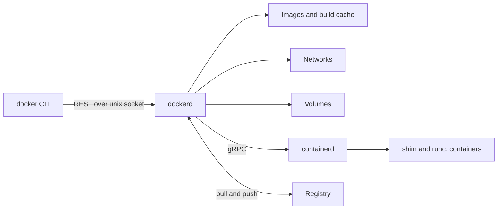
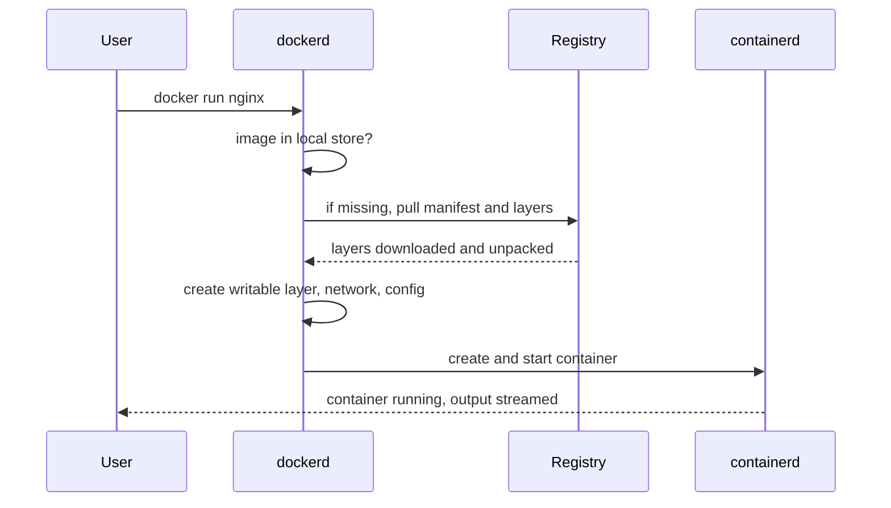
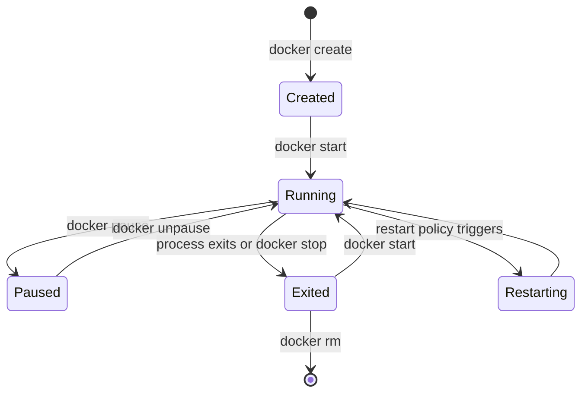

# Docker Handbook — Part 2: Docker Core

# Chapter 5 — Docker Architecture and Lifecycle

## 5.1 Why it exists

Before Docker, using Linux containers meant hand-wiring namespaces, cgroups, and root filesystems. Docker's contribution was the **developer experience**: one tool to build an image, ship it through a registry, and run it anywhere. Understanding its architecture explains where each kind of failure (build, pull, run, network, disk) originates.

## 5.2 How it works

### Client-server model

The `docker` command is only a **client**. It sends REST API calls over a Unix socket (`/var/run/docker.sock`) to the **Docker daemon** (`dockerd`), which does the real work.



| Component | Responsibility |
|---|---|
| **Docker CLI** | Parses commands, calls the API. Can point at a remote daemon with `DOCKER_HOST` |
| **dockerd** | API, image builds, networks, volumes, orchestrates containerd |
| **containerd + runc** | Actually run containers (Chapter 4) |
| **Image** | Read-only template: layers plus metadata (Chapter 7) |
| **Container** | A running (or stopped) instance of an image plus a writable layer |
| **Network** | Virtual networks that connect containers (Chapter 14) |
| **Volume** | Persistent storage managed outside the container's lifecycle (Chapter 13) |
| **Registry** | Server that stores and distributes images (Chapter 16) |

> **Important:** Access to the Docker socket is **equivalent to root on the host**. Anyone who can talk to the daemon can start a privileged container mounting the host filesystem. Treat membership of the `docker` group accordingly.

### What happens on `docker run nginx`



Key point: **pull happens only if the image is missing locally** (or you use `--pull always`). A mutable tag like `latest` cached locally is a classic source of "it runs a different version on that node" bugs.

### Container lifecycle



`docker run` = `create` + `start` (+ `attach` if not detached). A container is **Running only while its main process (PID 1) is alive**. When PID 1 exits, the container exits; this is why "container exits immediately" usually means the main command finished or crashed.

### Stopping gracefully

`docker stop` sends **SIGTERM**, waits (default 10 s), then sends **SIGKILL**. `docker kill` sends SIGKILL immediately. Whether your app shuts down cleanly depends on whether PID 1 handles SIGTERM (Chapter 11).

### Restart policies

| Policy | Behavior |
|---|---|
| `no` (default) | Never restart |
| `on-failure[:N]` | Restart on non-zero exit |
| `always` | Always restart, including after daemon restart |
| `unless-stopped` | Like `always`, except if manually stopped |

## 5.3 Kubernetes relationship

| Docker concept | Kubernetes equivalent |
|---|---|
| Docker daemon | **Absent** on the node's runtime path: kubelet calls containerd/CRI-O via CRI |
| `docker run` | Pod spec; the kubelet performs the equivalent steps |
| Image pull if missing | `imagePullPolicy` (`IfNotPresent`, `Always`, `Never`) |
| Restart policy | Pod `restartPolicy` (`Always`, `OnFailure`, `Never`) |
| `docker stop` (10 s grace) | `terminationGracePeriodSeconds` (default **30 s**) |
| Container `Exited` state | `Terminated`; repeated failures give `CrashLoopBackOff` |

A pod is not a Docker concept: it is a Kubernetes grouping with shared namespaces (Chapter 2). Full mapping in Chapter 18.

## 5.4 How it breaks in production

- **Daemon down / unreachable:** `Cannot connect to the Docker daemon`. Check `systemctl status docker` and the socket path.
- **Permission denied on the socket:** user is not in the `docker` group (and adding them grants root-equivalent access).
- **Disk full on `/var/lib/docker`:** old images, stopped containers, dangling volumes, and unbounded JSON logs accumulate. Prune, and set log rotation (`max-size`, `max-file`).
- **Container exits immediately:** main process finished or crashed. Check `docker logs` and `docker inspect` for `ExitCode`.
- **Stale `latest`:** the node already has an older image under the same tag and does not pull.
- **Slow `docker stop`:** app ignores SIGTERM, so you always wait the full timeout.

> **Production Insight:** Exit codes tell the story. **0** clean exit, **1** app error, **126/127** command not executable/not found, **137** SIGKILL (often OOM), **143** SIGTERM (graceful stop).

> **Common Pitfall:** Running `docker run -d` with a command that daemonizes itself (forks into the background). PID 1 exits, so the container exits. The main process must stay in the foreground.

## 5.5 Interview perspective

1. **Explain Docker architecture.** Client talks REST to `dockerd`, which manages images, networks, and volumes and delegates container execution to containerd and runc.
2. **Why does my container exit immediately?** Its main process exited. Containers live only as long as PID 1.
3. **`docker stop` vs `docker kill`?** Stop sends SIGTERM then SIGKILL after a timeout; kill sends SIGKILL (or a chosen signal) immediately.
4. **Why is the Docker socket dangerous?** Whoever controls the daemon can launch privileged containers and gain host root.
5. **Does Kubernetes need the Docker daemon?** No. It uses containerd or CRI-O through CRI.

> **Interview Tip:** Mention exit codes (137, 143) unprompted. It signals production experience.

---

# Chapter 6 — Essential Commands (Reference)

## 6.1 Why it exists

You do not need 100 commands. About 25 cover almost every real workflow. They are grouped below by **what you are trying to do**, with the Kubernetes counterpart where one exists.

## 6.2 Commands by workflow

### Run and manage

| Goal | Command | K8s counterpart |
|---|---|---|
| Run in background with settings | `docker run -d --name web -p 8080:80 -e KEY=val -v data:/data --memory 256m --restart unless-stopped nginx` | Pod/Deployment spec |
| Throwaway test container | `docker run --rm -it alpine sh` | `kubectl run -it --rm tmp --image=alpine -- sh` |
| List containers (incl. stopped) | `docker ps -a` | `kubectl get pods` |
| Stop / start / restart | `docker stop web`, `docker start web`, `docker restart web` | `kubectl rollout restart` |
| Remove | `docker rm -f web` | `kubectl delete pod` |

### Inspect and debug

| Goal | Command | K8s counterpart |
|---|---|---|
| Logs (follow, last 100 lines) | `docker logs -f --tail 100 web` | `kubectl logs -f --tail=100 pod` |
| Shell into running container | `docker exec -it web sh` | `kubectl exec -it pod -- sh` |
| Full config and state | `docker inspect web` | `kubectl describe pod` / `-o yaml` |
| Extract one field | `docker inspect -f '{{.State.ExitCode}}' web` | `kubectl get pod -o jsonpath=...` |
| Live CPU/memory | `docker stats` | `kubectl top pod` |
| Processes inside | `docker top web` | `kubectl exec pod -- ps` |
| Event stream | `docker events` | `kubectl get events` |
| Files changed vs image | `docker diff web` | n/a (see copy-on-write, Chapter 7) |
| Copy files in/out | `docker cp web:/etc/nginx/nginx.conf .` | `kubectl cp` |

### Build and ship

| Goal | Command |
|---|---|
| Build an image | `docker build -t myapp:1.4.2 .` |
| Tag for a registry | `docker tag myapp:1.4.2 registry.example.com/team/myapp:1.4.2` |
| Push / pull | `docker push ...` / `docker pull ...` |
| See layers and sizes | `docker history myapp:1.4.2` |
| Offline transfer | `docker save -o myapp.tar myapp:1.4.2` / `docker load -i myapp.tar` |

### Housekeeping

| Goal | Command | Caution |
|---|---|---|
| Disk usage by type | `docker system df` | Safe |
| Remove stopped containers, dangling images, unused networks | `docker system prune` | Does not touch volumes unless `--volumes` |
| Remove all unused images | `docker image prune -a` | Next run re-pulls |
| Inspect networks / volumes | `docker network ls/inspect`, `docker volume ls/inspect` | Safe |

> **Common Pitfall:** `docker system prune --volumes` deletes unused **volumes, which can hold database data**. Never run it blindly on a shared host.

### Compose in half a page (local dev only)

Compose describes a multi-container app in one file for **local development and CI**. Production orchestration is Kubernetes.

```yaml
# compose.yaml
services:
  api:
    build: .
    ports: ["8080:8080"]
    environment:
      DB_HOST: db
    depends_on: [db]
  db:
    image: postgres:16
    volumes: [dbdata:/var/lib/postgresql/data]
volumes:
  dbdata:
```

```bash
docker compose up -d      # create networks, volumes, start services
docker compose ps
docker compose logs -f api
docker compose down       # remove containers and network (add -v for volumes)
```

Services reach each other by **service name** (`db`) through Compose's built-in DNS. The Compose to Deployment+Service comparison is in Chapter 18.

## 6.3 How it breaks in production

- Debugging with `docker` commands **on a Kubernetes node** returns nothing; use `crictl` (Chapter 4).
- `docker exec` fails on images with no shell (distroless): use a debug image or ephemeral container (Chapter 2).
- `docker logs` truncated or huge: depends on the logging driver and rotation settings.

## 6.4 Interview perspective

1. **How do you find out why a container died?** `docker ps -a` for state, `docker inspect -f '{{.State.ExitCode}} {{.State.OOMKilled}}'`, then `docker logs`.
2. **How do you see what changed in a container versus its image?** `docker diff`.
3. **What does `docker system prune` remove, and what is risky about it?** Stopped containers, dangling images, unused networks, build cache; the risk is `--volumes`, which deletes persistent data.

> **Interview Tip:** Interviewers rarely ask you to recite flags. They ask *"what would you run to diagnose X?"*. Practice answering with the inspect, logs, events, stats sequence.

---

# Part 2 in 60 Seconds

- Docker = **CLI → dockerd → containerd → runc**; the socket is root-equivalent.
- A container lives only as long as **PID 1**. Exit code 137 = SIGKILL, 143 = SIGTERM.
- `docker stop` = SIGTERM, wait, SIGKILL. Kubernetes: 30 s grace period by default.
- Diagnose with `ps -a`, `inspect`, `logs`, `stats`, `events`; clean up with `system df` before `prune`.
- Compose is for local dev; Kubernetes replaces it in production.
