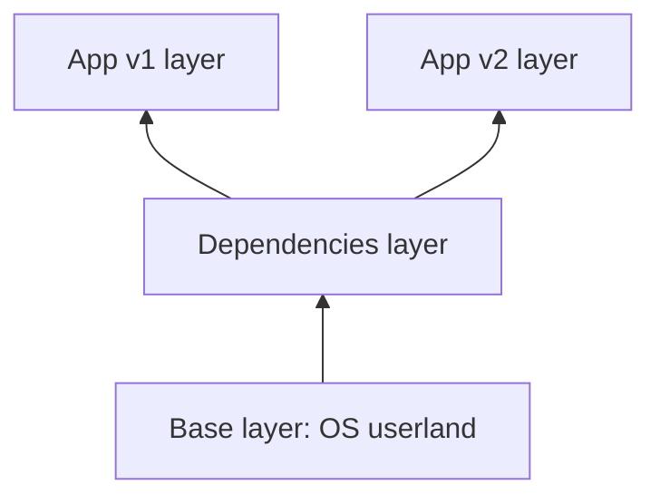
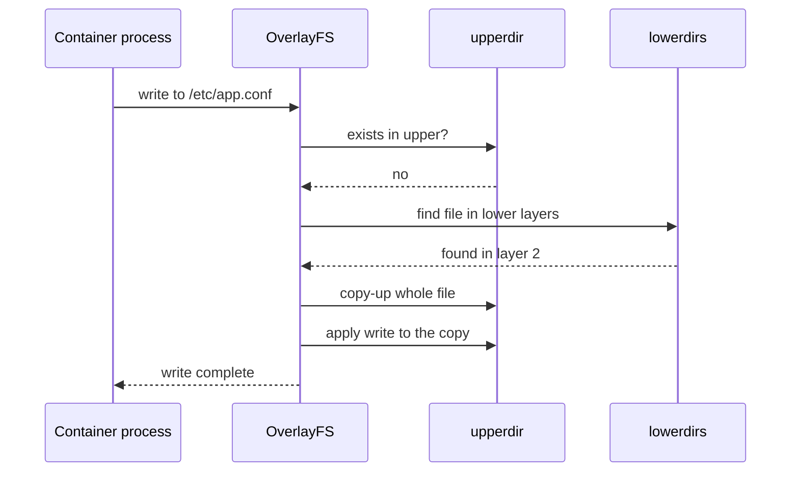
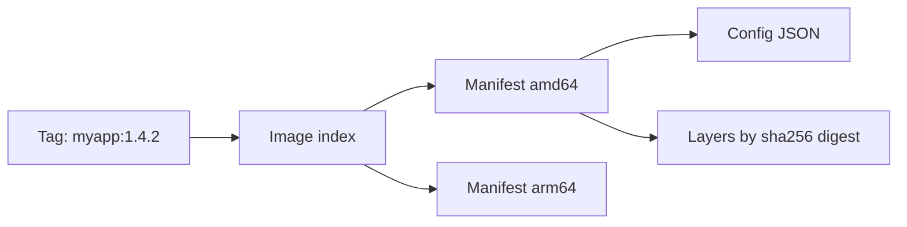
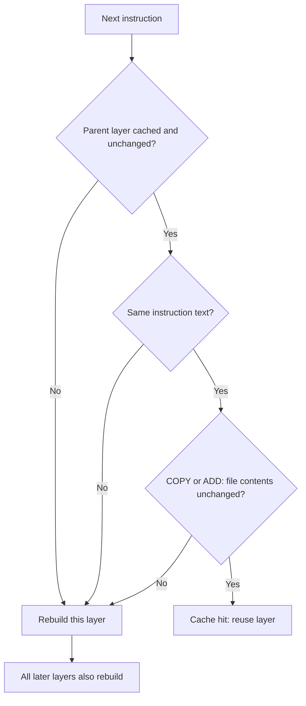
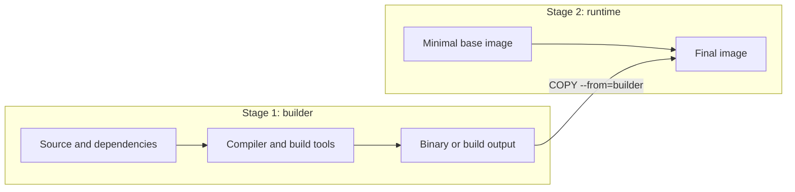

# Docker Handbook — Part 3: Image Internals

## 7.1 Why it exists

Shipping a full filesystem for every application version would be slow and wasteful: ten services built on the same base OS would store and transfer ten copies of it. Layered images solve this with **sharing and reuse**: identical layers are stored once, downloaded once, and shared by every container that needs them. Copy-on-write makes that sharing safe, because no container can modify the shared layers.

## 7.2 How it works

### 7.2.1 Layers

An image is an **ordered stack of read-only layers**, each a tarball of filesystem changes (files added, modified, or deleted).

- Instructions that change the filesystem (`RUN`, `COPY`, `ADD`) create layers. Metadata instructions (`ENV`, `CMD`, `EXPOSE`, `LABEL`) only add configuration.
- Layers are **content-addressed**: identified by the SHA-256 of their content. Same content, same ID.
- Layers are **immutable**. A new version means new layers on top, never edits to old ones.



Here, v1 and v2 share the first two layers. Pulling v2 on a node that has v1 downloads **only the app layer**.

### 7.2.2 OverlayFS and overlay2

A union filesystem presents several directories as one. Docker's default storage driver, **overlay2**, uses the kernel's **OverlayFS**:

| OverlayFS term | Meaning |
|---|---|
| `lowerdir` | The image's read-only layers (can be many) |
| `upperdir` | The container's **writable layer** (one per container) |
| `workdir` | Scratch space the kernel needs for atomic operations |
| `merged` | The unified view the container sees as its root |

```
   What the process sees:  merged  (/)
   ┌──────────────────────────────────────┐
   │ upperdir: container writable layer   │ ← per container, deleted with it
   ├──────────────────────────────────────┤
   │ layer 3: COPY app                    │
   │ layer 2: RUN install deps            │ ← lowerdirs: read-only, shared
   │ layer 1: base OS                     │
   └──────────────────────────────────────┘
```

Lookup works top-down: the first layer containing the path wins. On a Docker host, layers live under `/var/lib/docker/overlay2/`; with the containerd runtime they live under `/var/lib/containerd/`. Newer Docker releases may use the containerd image store, and the on-disk layout differs, but the concepts are identical.

```bash
docker inspect -f '{{json .GraphDriver.Data}}' web   # shows LowerDir, UpperDir, MergedDir
mount | grep overlay                                  # the actual overlay mount
```

### 7.2.3 Copy-on-write (CoW)

**Reading** a file never copies anything: the kernel finds it in the first layer that has it.
**Writing** to a file that lives in a lower layer triggers a **copy-up**: the whole file is copied into the upper layer, then modified there. Further changes use the upper copy.
**Deleting** a lower-layer file writes a **whiteout** marker in the upper layer, which hides the file without removing it from the image.



Consequences you must know:

- **The first write to a large file is slow** (the entire file is copied up). Never run a database in the container layer.
- **Deleting a file in a later layer does not shrink the image.** The data still exists in the earlier layer, just hidden.
- **Container layer data dies with the container.** Persistence needs volumes (Chapter 13).
- **Anything written into a layer is recoverable from the image**, including secrets copied then deleted (Chapter 15).

```dockerfile
# Wrong: the 500 MB archive stays in layer 1 forever
COPY big.tar.gz /tmp/
RUN tar xf /tmp/big.tar.gz -C /opt && rm /tmp/big.tar.gz

# Right: download, extract, delete inside ONE layer
RUN curl -fsSL https://example.com/big.tar.gz | tar xz -C /opt
```

### 7.2.4 OCI image format, manifest, digest vs tag

An image in a registry is **three kinds of objects**, all content-addressed:

- **Manifest:** JSON listing the config and the layers (by digest, size, media type).
- **Config:** JSON with environment, entrypoint, cmd, user, working directory, and layer history.
- **Layers:** compressed tarballs.

For multi-architecture images, a tag points to an **image index** (manifest list) containing one manifest per platform (`linux/amd64`, `linux/arm64`). The client picks the one matching the node.



| | Tag | Digest |
|---|---|---|
| Example | `myapp:1.4.2` | `myapp@sha256:9f86d0...` |
| Mutable? | **Yes**, can be repointed | **No**, tied to exact content |
| Use for | Humans, readability | Reproducibility, security, rollbacks |

**Pull flow:** resolve tag to manifest digest, fetch the manifest, download only the layers not already present, verify each digest. In production, deploy by digest (or immutable tags) so that "same version" always means "same bytes".

## 7.3 Kubernetes relationship

- **Layer sharing happens per node.** Each node pulls and stores layers itself; a good layer order makes rollouts pull little data.
- **Ephemeral storage:** a container's writable layer, its logs, and `emptyDir` volumes count towards **ephemeral-storage**. `resources.limits.ephemeral-storage` exceeded means the pod is evicted.
- `imagePullPolicy: IfNotPresent` with a **mutable tag** means nodes may run different bytes for the "same" image. Pin by digest or use unique tags.
- Read-only root filesystems (`readOnlyRootFilesystem: true`) turn the writable layer off, forcing apps to write only to explicit volumes.

## 7.4 How it breaks in production

- **Node `DiskPressure`:** image layers, writable layers, and logs filled the disk; kubelet evicts pods and garbage-collects images.
- **`no space left on device` with free blocks:** inode exhaustion from millions of small files.
- **Bloated images:** slow pulls, slow autoscaling, from `rm` in a later layer, build tools left in, or large base images.
- **Slow first write / DB in container layer:** copy-up cost and poor overlay write performance.
- **Different nodes, different versions:** mutable tag plus `IfNotPresent`.
- **Leaked secrets:** a credential copied into any layer is retrievable with `docker history` or by extracting the layer.

> **Production Insight:** `docker history <image>` and tools like `dive` show per-layer size. If an image is unexpectedly large, find the layer that added the weight.

> **Common Pitfall:** Believing `RUN rm` in a later instruction removes data from the image. It only masks it with a whiteout.

## 7.5 Interview perspective

1. **How do layers make Docker efficient?** Content-addressed, immutable layers are stored and transferred once and shared across images and containers.
2. **Explain copy-on-write.** Containers share read-only image layers. The first write to a file copies it into the container's writable layer; later reads and writes use that copy.
3. **Why doesn't deleting a file in a later `RUN` reduce image size?** Earlier layers are immutable; the delete is recorded as a whiteout in a new layer.
4. **Tag vs digest?** A tag is a mutable pointer; a digest is an immutable content hash. Production should rely on digests or immutable tags.
5. **Where does a container's writable data go, and when is it lost?** The `upperdir`, deleted when the container is removed.

> **Interview Tip:** Draw the lowerdir/upperdir/merged picture and walk through a write. It is the standard way to prove you understand CoW.

---

# Chapter 8 — Build Cache

## 8.1 Why it exists

Rebuilding every layer on every change would make builds take minutes instead of seconds. Docker reuses layers whose inputs have not changed. Understanding the **invalidation rules** is the difference between a 20-second and a 10-minute build.

## 8.2 How it works

For each instruction, the builder checks whether it already has a cached layer for it:



Key rules:

- **Cascade:** once one layer is invalidated, **every later layer rebuilds**. Order matters more than anything else.
- **`RUN` is cached by its command text**, not its effect. `RUN apt-get update` is "unchanged" tomorrow even though the package index has moved.
- **`COPY`/`ADD` are cached by file content checksum**, not timestamps.
- **`ARG` changes** invalidate from the first instruction that uses them.

### The one pattern that matters: stable things first

```dockerfile
# Bad: any source change invalidates dependency install
COPY . .
RUN npm ci

# Good: dependencies only reinstall when manifests change
COPY package.json package-lock.json ./
RUN npm ci
COPY . .
```

The same pattern applies to `requirements.txt`, `go.mod`/`go.sum`, `pom.xml`, and so on.

### Supporting practices

- **`.dockerignore`:** exclude `.git`, `node_modules`, build output, and local env files. A smaller context uploads faster, and irrelevant file changes stop invalidating `COPY . .`.
- **Combine `apt-get update` with `install`** in one `RUN`, so a stale index is never cached separately from the install.
- **Refresh when needed:** `docker build --pull` re-checks the base image, `--no-cache` ignores the cache entirely. Use them in scheduled security rebuilds.

### CI/CD: the cold cache problem

CI runners are usually **ephemeral**, so every build starts with an empty cache and rebuilds all layers. The fix is an **external cache** the builder can import and export (for example, a registry-based cache with BuildKit):

```bash
docker buildx build \
  --cache-from type=registry,ref=registry.example.com/team/myapp:buildcache \
  --cache-to   type=registry,ref=registry.example.com/team/myapp:buildcache,mode=max \
  -t registry.example.com/team/myapp:1.4.2 --push .
```

Pipeline specifics (BuildKit, buildx, cache mounts) are in Chapter 17.

## 8.3 Kubernetes relationship

Kubernetes does not build images; the cache lives in your CI system. But layer ordering has a **runtime payoff**: if only the last small layer changes between releases, nodes pull only that layer, so rollouts and autoscaling are fast. A badly ordered Dockerfile changes early layers and forces every node to re-pull most of the image on every release.

## 8.4 How it breaks in production

- **Cache never hits:** `COPY . .` before the dependency step, or a changing file (generated timestamp, version file) copied early.
- **Stale packages:** cached `apt-get update` layer means security patches are silently skipped.
- **Stale base image:** cache reuses an old `FROM` layer; `--pull` is needed to pick up patches.
- **Slow CI:** no remote cache; every build is cold.
- **Secrets in build args** are visible in `docker history` and may bust the cache when they change.
- **Disk growth:** build cache accumulates on runners; prune periodically (`docker builder prune`).

> **Production Insight:** Run a scheduled no-cache rebuild (for example weekly) so base-image and OS package fixes are picked up, while daily builds stay fast.

> **Common Pitfall:** Putting `COPY . .` as the first instruction after `FROM`. It guarantees a cache miss on every code change.

## 8.5 Interview perspective

1. **How does Docker decide whether to use the cache?** Per instruction: same parent, same instruction text, and for `COPY`/`ADD` the same file checksums.
2. **Why is instruction order important?** Invalidation cascades to all later layers, so put rarely-changing steps first.
3. **A build is slow in CI but fast locally. Why?** Ephemeral runners have no cache; add registry or CI-native cache export/import.
4. **Why can `RUN apt-get update` be dangerous with caching?** It is cached by command text, so the package index can become stale.
5. **How do you keep caching and still get security patches?** Scheduled `--pull --no-cache` rebuilds.

---

# Chapter 9 — Multi-stage Builds

## 9.1 Why it exists

Building software needs compilers, SDKs, package managers, and source code. **Running** it usually needs only the compiled output. Shipping the build environment in the final image means larger images, slower pulls, more vulnerabilities, and an easier path for attackers. Multi-stage builds use **multiple `FROM` stages** in one Dockerfile and copy only the needed artifacts into a clean final stage.

## 9.2 How it works



Everything in stage 1 is **discarded** from the final image; only what you `COPY --from` survives.

```dockerfile
# Stage 1: build
FROM golang:1.25 AS builder
WORKDIR /src
COPY go.mod go.sum ./
RUN go mod download
COPY . .
RUN CGO_ENABLED=0 go build -o /out/app ./cmd/app

# Stage 2: runtime
FROM gcr.io/distroless/static:nonroot
COPY --from=builder /out/app /app
USER nonroot
ENTRYPOINT ["/app"]
```

### Typical size impact (approximate)

| Stack | Single stage | Multi-stage |
|---|---|---|
| Go | ~800 MB to 1 GB (full toolchain) | ~10 to 25 MB (static binary on distroless or scratch) |
| Java | ~500 to 800 MB (JDK and Maven) | ~200 to 300 MB (JRE plus jar) |
| Node | ~900 MB to 1 GB (full image, dev dependencies) | ~100 to 200 MB (slim image, production dependencies) |

Exact numbers vary, but the order-of-magnitude reduction is consistent.

### Choosing the final stage

| Final base | Pros | Trade-offs |
|---|---|---|
| **Slim distro** (e.g. `-slim`) | Familiar, has a shell and package manager | Larger, more CVEs |
| **Alpine** | Very small, has a shell | musl libc: some glibc binaries fail |
| **Distroless** | No shell or package manager, tiny attack surface | Harder to debug; needs ephemeral containers |
| **scratch** | Empty; smallest possible | You supply everything (CA certs, timezone data, users) |

### Useful features

- `AS name` and `COPY --from=name` to reference stages. `--from` can also copy from another image.
- `docker build --target test .` stops at a named stage: reuse one Dockerfile for dev, test, and production.
- BuildKit builds independent stages **in parallel** and skips stages the final image does not need.

## 9.3 Kubernetes relationship

- **Smaller images** mean faster pulls, quicker pod startup, faster autoscaling, and less node disk pressure.
- **Fewer packages** means fewer findings from image scanners used in admission and CI gates.
- **No shell** (distroless, scratch) pairs naturally with `readOnlyRootFilesystem` and non-root `securityContext`, but requires `kubectl debug` with an ephemeral container for troubleshooting (Chapter 2).

## 9.4 How it breaks in production

- **TLS errors from a `scratch` image:** no CA certificates. Copy `/etc/ssl/certs/ca-certificates.crt` from the builder.
- **Wrong timezone or user lookup:** `scratch` lacks timezone data and `/etc/passwd`.
- **`exec ... no such file or directory` for a binary that exists:** dynamically linked glibc binary running on Alpine (musl) or scratch. Build statically (`CGO_ENABLED=0` for Go) or match the libc.
- **Missing runtime files:** forgot to `COPY --from` configs, templates, or migrations.
- **Permission denied:** copied files are owned by root and the runtime user is non-root; use `COPY --chown`.
- **Shell-form `CMD` fails:** no `/bin/sh` in distroless or scratch; use exec form (Chapter 11).
- **Secrets from the build stage:** the *final* image is clean, but intermediate stages can remain in the local cache; use BuildKit secret mounts (Chapter 17) instead of `COPY`-ing credentials.

> **Production Insight:** Add `docker build --target test` to CI so tests run inside the same build environment that produces the artifact, without that environment reaching production.

> **Common Pitfall:** Using a multi-stage build but copying the entire build directory (`COPY --from=builder /src /app`). You keep the bloat and the source code.

## 9.5 Interview perspective

1. **What problem do multi-stage builds solve?** They separate the build environment from the runtime image, reducing size and attack surface.
2. **How do you get a ~10 MB Go image?** Static build in a builder stage, copy the binary to `scratch` or distroless.
3. **What are the downsides of distroless?** No shell or package manager, so debugging needs ephemeral containers or debug image variants.
4. **How do multi-stage builds improve security?** Fewer binaries and libraries to exploit, no compilers, and source code and build credentials stay out of the final image.
5. **Why does my binary say "not found" on Alpine?** Linked against glibc; Alpine uses musl.

> **Interview Tip:** Quote a before-and-after size from a real project. Concrete numbers (e.g. "1.1 GB to 38 MB") are far more convincing than generalities.

---

# Part 3 in 60 Seconds

- An image = **manifest + config + immutable, content-addressed layers**. A tag is a mutable pointer; a **digest** is the truth.
- **OverlayFS:** read-only `lowerdir`s + one writable `upperdir` = `merged`. Writes **copy up**; deletes leave **whiteouts**, so images never shrink by deleting.
- Build cache invalidation **cascades**: put stable steps (dependencies) first, volatile steps (source) last. CI needs an external cache.
- Multi-stage builds ship only artifacts: smaller, faster to pull, fewer CVEs.
- Writable-layer data counts as ephemeral storage and disappears with the container.
