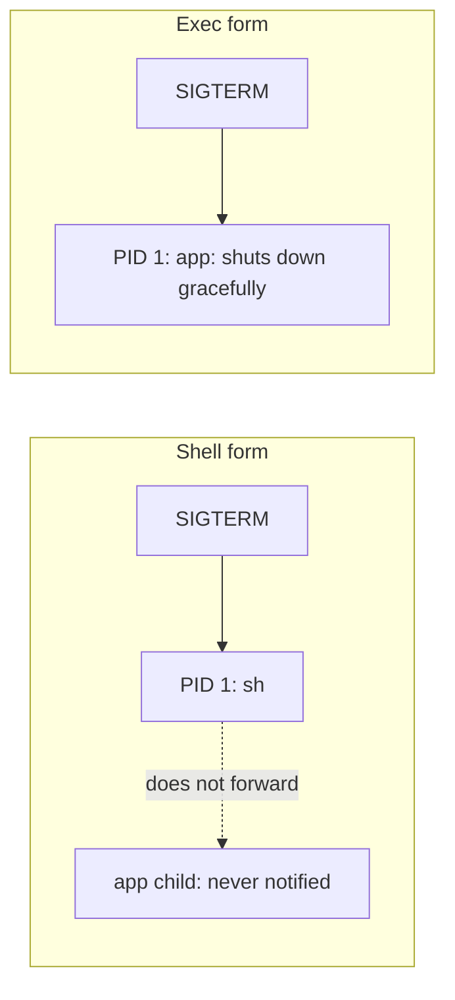
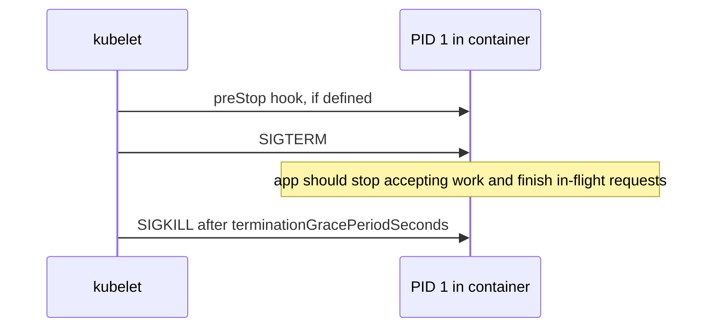

# Docker Handbook — Part 4: Dockerfile

# Chapter 10 — Dockerfile Instruction Reference

## 10.1 Why it exists

A Dockerfile is the **declarative recipe** for an image: each instruction either changes the filesystem (creating a layer) or sets metadata. Knowing exactly what each instruction does, and how Kubernetes treats the result, avoids most Dockerfile bugs.

## 10.2 Instruction reference

### Build-time instructions

| Instruction | Syntax | Best practice | Anti-pattern |
|---|---|---|---|
| **FROM** | `FROM image:tag AS stage` | Pin a specific version (or digest); use minimal bases; name stages | `FROM ubuntu:latest` (non-reproducible, surprise upgrades) |
| **RUN** | `RUN apt-get update && apt-get install -y --no-install-recommends pkg && rm -rf /var/lib/apt/lists/*` | Chain related commands in one layer; clean caches in the same layer | Separate `update` and `install` layers; `curl ... \| sh` without verification |
| **COPY** | `COPY --chown=1000:1000 src/ /app/` | Default choice for adding files; copy manifests before source (Chapter 8) | `COPY . .` as first step; copying secrets or `.git` |
| **ADD** | `ADD app.tar.gz /opt/` | Use only for auto-extracting a **local** tarball | Remote URLs (no checksum control, no cache clarity); using it where `COPY` suffices |
| **WORKDIR** | `WORKDIR /app` | Always absolute; creates the directory if missing | `RUN cd /app && ...` (does not persist); relative paths |
| **ENV** | `ENV NODE_ENV=production` | Non-secret runtime defaults | Passwords or tokens (stored in the image and visible via inspect) |
| **ARG** | `ARG VERSION=1.0` | Build-time parameters only (versions, flags) | Passing secrets (visible in `docker history`); assuming it exists at runtime |
| **LABEL** | `LABEL org.opencontainers.image.source="https://git.example.com/app"` | Standard OCI keys: source, version, revision | Free-form unstructured labels no tooling reads |

### Runtime-metadata instructions

| Instruction | Syntax | Best practice | Anti-pattern |
|---|---|---|---|
| **CMD** | `CMD ["node","server.js"]` | Default command or default args; **exec form** (Chapter 11) | Shell form; several CMDs (only the last counts) |
| **ENTRYPOINT** | `ENTRYPOINT ["/app"]` | Fixed executable; combine with CMD for default args (Chapter 11) | Shell form; scripts that do not `exec` the app |
| **EXPOSE** | `EXPOSE 8080` | Document the listening port | Believing it publishes or secures the port (it does neither) |
| **USER** | `USER 10001` | Drop root; prefer a **numeric** UID | Leaving the final stage as root |
| **VOLUME** | `VOLUME /data` | Document a persistent-data path | Declaring volumes for paths you later modify in the build |
| **HEALTHCHECK** | `HEALTHCHECK --interval=30s --timeout=3s CMD curl -f http://localhost:8080/health \|\| exit 1` | Useful for plain Docker and Compose | Relying on it in Kubernetes (it is ignored there) |

> **Important:** `ARG` exists only during the build; `ENV` persists into the running container. `ARG` values still show up in image history, so neither is a place for secrets (Chapter 15).

## 10.3 Kubernetes relationship

| Dockerfile | In Kubernetes |
|---|---|
| `ENTRYPOINT` / `CMD` | Overridden by pod `command` / `args` (Chapter 11) |
| `ENV` | Defaults; pod `env`, ConfigMaps, and Secrets override or add |
| `WORKDIR` | Overridden by `workingDir` |
| `EXPOSE` | Informational; `containerPort` is also informational; traffic goes through Services |
| `USER` | `securityContext.runAsUser` overrides. `runAsNonRoot: true` **fails if the image user is a name, not a number**, because Kubernetes cannot verify a name |
| `HEALTHCHECK` | **Ignored.** Use liveness, readiness, and startup probes |
| `VOLUME` | Treat as documentation; define real volumes in the pod spec (Chapter 13) |
| `LABEL` | Metadata for scanners and tooling; not Kubernetes labels |

## 10.4 How it breaks in production

- **`CreateContainerConfigError: image has non-numeric user`:** `USER appuser` plus `runAsNonRoot: true`. Use `USER 10001`.
- **Surprise version drift:** `FROM node:latest` builds differently next month.
- **Secret leakage:** token passed via `ARG` or `ENV` is recoverable from the image.
- **Container runs but is unreachable:** assumed `EXPOSE` opens the port, but nothing published or no Service exists.
- **Healthy in Compose, unhealthy in Kubernetes:** `HEALTHCHECK` was the only check and no probe was defined, so traffic reaches broken pods.
- **Wrong working directory:** `RUN cd` used instead of `WORKDIR`.

> **Common Pitfall:** Assuming `ADD` is "COPY plus extras". The extras (remote fetch, silent auto-extract) are exactly what causes surprises.

## 10.5 Interview perspective

1. **`COPY` vs `ADD`?** Use `COPY`; `ADD` also fetches URLs and auto-extracts local archives, which is rarely what you want.
2. **`ARG` vs `ENV`?** `ARG` is build-time only; `ENV` persists at runtime. Neither is safe for secrets.
3. **Does `EXPOSE` publish a port?** No. It documents it. Publishing is `-p` in Docker, a Service in Kubernetes.
4. **Does Kubernetes honor `HEALTHCHECK`?** No. Use probes.
5. **Why does `runAsNonRoot` sometimes fail with a non-root image?** The image user is a name instead of a numeric UID.

---

# Chapter 11 — CMD, ENTRYPOINT, and PID 1

## 11.1 Why it exists

This is the **single most common source of "works locally, misbehaves in Kubernetes"** problems: containers that ignore shutdown signals, arguments that are not applied, environment variables that are not expanded, and scripts that fail with cryptic errors. All trace back to how the main process is started.

## 11.2 How it works

### CMD and ENTRYPOINT

| Defined | Behavior |
|---|---|
| Neither | Inherited from the base image |
| `CMD` only | The whole command; `docker run image other-cmd` **replaces** it |
| `ENTRYPOINT` only | Fixed executable; `docker run image args` **appends** args |
| Both | `ENTRYPOINT` is the executable, `CMD` supplies **default arguments**, overridable at run time |

```dockerfile
ENTRYPOINT ["/app/server"]
CMD ["--port=8080"]          # default; docker run image --port=9090 overrides only this
```

### Exec form vs shell form

| | Exec form `["app","arg"]` | Shell form `app arg` |
|---|---|---|
| Executed as | Directly, no shell | `/bin/sh -c "app arg"` |
| PID 1 is | **Your app** | **`sh`** |
| Receives SIGTERM | Yes (if it handles it) | **No**, `sh` does not forward it |
| `$VAR` expansion | **No** (no shell) | Yes |
| Needs `/bin/sh` in image | No | Yes |



**Rule:** use **exec form**. If you need variable expansion or setup logic, use an entrypoint script that finishes with `exec`:

```sh
#!/bin/sh
set -e
# ...render config, wait for dependencies, etc...
exec "$@"        # replaces the shell with the app, which becomes PID 1
```

### PID 1 rules (why signals get lost)

As introduced in Chapter 2, the first process in a PID namespace is special:

1. **Signals with default actions are ignored** unless the process installs a handler. A runtime that does not handle SIGTERM (many Node.js and Python programs) will not stop on SIGTERM as PID 1.
2. **Zombie reaping:** orphaned child processes are re-parented to PID 1. If PID 1 never calls `wait()`, zombies accumulate and can exhaust the PID limit.
3. **If PID 1 exits, everything in the container dies.**

Fixes: handle SIGTERM in the app, and use a tiny init such as **tini** (`docker run --init`, or as the ENTRYPOINT) when the app spawns children.

## 11.3 Kubernetes relationship

| Dockerfile | Pod spec field |
|---|---|
| `ENTRYPOINT` | `command` |
| `CMD` | `args` |

Setting `command` replaces `ENTRYPOINT` **and discards the image's CMD**. Setting only `args` keeps the ENTRYPOINT and replaces CMD.

**Pod termination sequence:**



If PID 1 ignores SIGTERM, the pod always sits for the full grace period (default 30 s) and is then killed, dropping in-flight requests. (If `shareProcessNamespace` is enabled, the pause container becomes PID 1 and reaps zombies.)

## 11.4 How it breaks in production

- **Slow, ugly rollouts:** every pod takes 30 s to terminate, then drops connections (502/504 spikes during deploys). Cause: shell form or no SIGTERM handler.
- **`$HOME` or `$PORT` appears literally in args:** exec form does not expand variables. Use a script or `sh -c` deliberately.
- **JSON typo silently becomes shell form:** malformed brackets or single quotes in `CMD ['app']` make Docker treat the line as a shell command.
- **`exec format error` / `no such file or directory` on a script that exists:** Windows CRLF line endings (`^M` in the shebang), or missing shebang.
- **`permission denied`:** script not executable; fix with `COPY --chmod=755` or `chmod +x`.
- **Zombie buildup:** app spawns subprocesses with no init.
- **Custom args ignored:** CMD was expected to be appended, but ENTRYPOINT was not defined.

> **Production Insight:** Test graceful shutdown deliberately: `docker stop` should return in under a second for a well-behaved app. If it takes the full 10 s, you have a signal-handling bug that will cost you 30 s per pod in Kubernetes.

> **Common Pitfall:** An entrypoint script that ends with `node server.js` instead of `exec node server.js`. The shell stays PID 1 and swallows SIGTERM.

## 11.5 Interview perspective

1. **CMD vs ENTRYPOINT?** ENTRYPOINT is the fixed executable; CMD provides overridable defaults or the whole command if no ENTRYPOINT.
2. **Why prefer exec form?** The app is PID 1 and receives signals directly; no shell dependency.
3. **How do these map to Kubernetes?** `command` overrides ENTRYPOINT (and drops CMD), `args` overrides CMD.
4. **Why does my pod take 30 s to terminate?** PID 1 does not handle SIGTERM (often shell form or a runtime with no handler), so Kubernetes waits for the grace period then sends SIGKILL.
5. **What is a zombie process and why does PID 1 matter?** A finished child whose parent never called `wait()`. Orphans re-parent to PID 1, so PID 1 must reap them, or you use tini.

> **Interview Tip:** Tie this to a deployment story: "502s during rollouts traced to shell-form CMD swallowing SIGTERM." Interviewers love failure stories with a root cause.

---

# Chapter 12 — Dockerfile Best Practices and Production Patterns

## 12.1 Why it exists

Individually correct instructions can still add up to a bad image: huge, root-run, non-reproducible, and slow to build. This chapter is a **checklist plus patterns** you can apply to any service, with the deeper mechanics already covered elsewhere.

## 12.2 The checklist

| Practice | Why | Details in |
|---|---|---|
| Pin base image versions (ideally digest) | Reproducible builds | Ch 7 |
| Use minimal bases and multi-stage builds | Size, CVEs | Ch 9 |
| Order: dependencies first, source last | Cache hits | Ch 8 |
| Add `.dockerignore` | Smaller context, fewer cache misses, no leaked files | Ch 8 |
| One concern per container, foreground main process | Clean lifecycle | Ch 5 |
| Exec-form `ENTRYPOINT`/`CMD`, handle SIGTERM | Graceful shutdown | Ch 11 |
| Run as a numeric non-root `USER` | Reduces blast radius | Ch 15 |
| No secrets in layers, `ENV`, or `ARG` | Layers are recoverable | Ch 15 |
| Log to stdout/stderr | Platform collects logs | Ch 14, 19 |
| Config from environment at runtime, not baked in | One image for all environments | below |
| Lint with `hadolint`, scan the image | Catch issues in CI | Ch 15, 17 |

A starter `.dockerignore`:

```
.git
node_modules
*.log
.env
Dockerfile
.dockerignore
dist
```

## 12.3 Patterns by stack

### Node.js

```dockerfile
FROM node:24-slim AS build
WORKDIR /app
COPY package.json package-lock.json ./
RUN npm ci
COPY . .
RUN npm run build && npm prune --omit=dev

FROM node:24-slim
ENV NODE_ENV=production
WORKDIR /app
COPY --from=build --chown=1000:1000 /app/dist ./dist
COPY --from=build --chown=1000:1000 /app/node_modules ./node_modules
COPY --from=build --chown=1000:1000 /app/package.json ./
USER 1000                       # numeric, so runAsNonRoot works in Kubernetes
EXPOSE 3000
CMD ["node", "dist/server.js"]  # exec form; app must handle SIGTERM
```

### Python

```dockerfile
FROM python:3.13-slim AS build
RUN python -m venv /opt/venv
ENV PATH="/opt/venv/bin:$PATH"
COPY requirements.txt .
RUN pip install --no-cache-dir -r requirements.txt

FROM python:3.13-slim
ENV PATH="/opt/venv/bin:$PATH" PYTHONUNBUFFERED=1
WORKDIR /app
COPY --from=build /opt/venv /opt/venv
COPY . .
USER 10001
CMD ["gunicorn", "-b", "0.0.0.0:8000", "app:app"]
```

`PYTHONUNBUFFERED=1` ensures logs reach stdout immediately instead of sitting in a buffer.

### Java

```dockerfile
FROM eclipse-temurin:21-jre
COPY --chown=10001:10001 target/app.jar /app/app.jar
USER 10001
ENTRYPOINT ["java", "-XX:MaxRAMPercentage=75", "-jar", "/app/app.jar"]
```

`MaxRAMPercentage` sizes the heap relative to the **container memory limit**, which prevents the OOMKilled-on-heap-growth scenario from Chapter 3. (Go: see the static-binary pattern in Chapter 9.)

### Anti-patterns to flag in review

| Anti-pattern | Fix |
|---|---|
| `FROM ...:latest` | Pin version or digest |
| Root user in final image | Numeric non-root `USER` |
| `apt-get install` without `--no-install-recommends` and cleanup | Combine and clean in one `RUN` |
| `COPY . .` first | Dependencies first |
| Running SSH, cron, and the app in one container | One process per container |
| Baking environment-specific config into the image | Env vars, ConfigMaps, Secrets |
| Writing logs to files inside the container | stdout/stderr |
| Using the build image as the runtime image | Multi-stage |

## 12.4 Kubernetes relationship

A good Dockerfile is what makes the **twelve-factor** model work on Kubernetes:

- **Stateless, disposable containers:** state lives in volumes or external services, not the container layer.
- **Config at runtime:** the same image promoted across environments, configured via env, ConfigMaps, and Secrets.
- **Logs on stdout/stderr:** collected by the node's logging agent.
- **Health via probes**, not `HEALTHCHECK`; **resources** via requests and limits, not baked-in flags.
- **Fast, predictable shutdown** through exec-form entrypoints and signal handling.

## 12.5 How it breaks in production

- **Same image behaves differently per environment:** config baked in, or a mutable tag.
- **Pod killed for memory despite "small app":** JVM or runtime heap not tied to the container limit.
- **Logs missing:** app writes to a file; or output is buffered (Python without `PYTHONUNBUFFERED`).
- **Image fails admission policy:** root user, `latest` tag, or unsigned/unscanned image.
- **Builds irreproducible:** unpinned base or packages; last week's image cannot be rebuilt identically.

> **Production Insight:** Run `hadolint` and an image scanner in CI as **gates**, not reports. Best practices that are not enforced decay within a few months.

> **Common Pitfall:** Fixing symptoms in the Dockerfile that belong in the platform, for example adding a `HEALTHCHECK` for Kubernetes or baking resource flags into the entrypoint.

## 12.6 Interview perspective

1. **How do you make an image smaller and safer?** Minimal base, multi-stage build, no build tools in runtime, non-root user, no secrets, scanned in CI.
2. **How do you make Docker builds fast?** Stable-first layer ordering, `.dockerignore`, and remote cache in CI.
3. **Why shouldn't environment config be baked into an image?** The image should be promoted unchanged across environments; config is injected at runtime.
4. **What would you flag in this Dockerfile review?** `latest` tag, root user, `COPY . .` early, secrets in `ENV`/`ARG`, shell-form `CMD`, build tools in the final stage.
5. **How should containers log?** To stdout/stderr, one stream, unbuffered; the platform handles collection.

> **Interview Tip:** If asked to "write a production Dockerfile", narrate your choices as you write: pinned base, dependencies first, multi-stage, numeric non-root user, exec-form CMD. The reasoning is what is being graded.

---

# Part 4 in 60 Seconds

- Instruction behavior: `COPY` over `ADD`, `WORKDIR` over `cd`, `ARG` is build-time only, **`HEALTHCHECK` and `EXPOSE` do not drive Kubernetes**.
- ENTRYPOINT = executable (`command`), CMD = default args (`args`). **Always exec form.**
- PID 1 ignores default-action signals and must reap zombies: handle SIGTERM, use `exec` in scripts, use tini when spawning children.
- Numeric `USER` makes `runAsNonRoot` work.
- Production Dockerfile = pinned base, stable-first order, multi-stage, non-root, no secrets, config at runtime, stdout logging, linted and scanned in CI.
