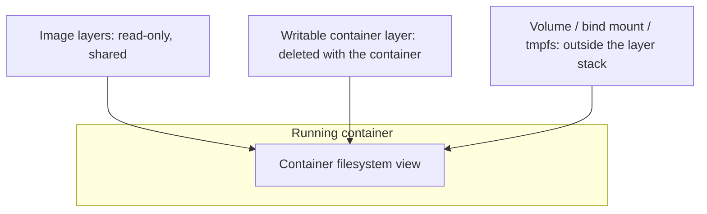
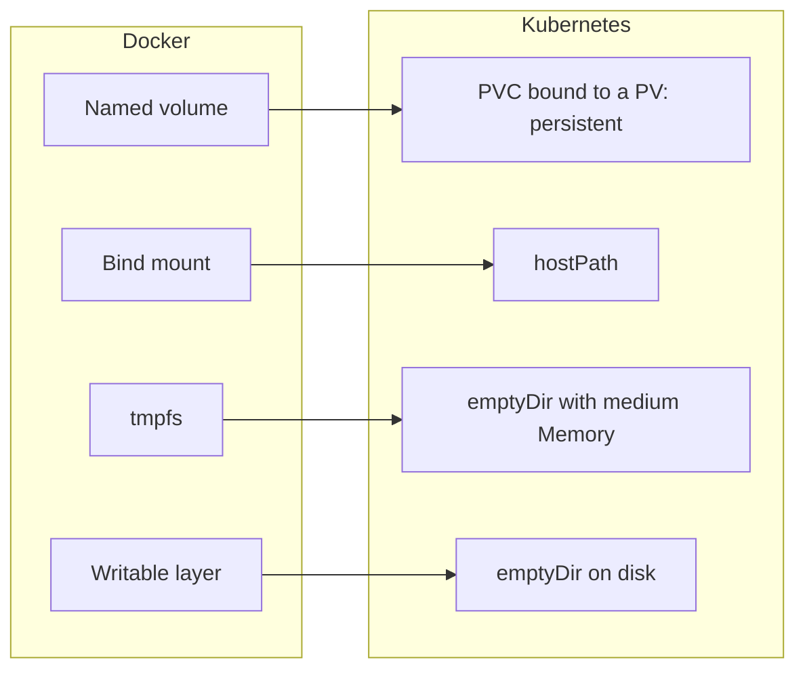
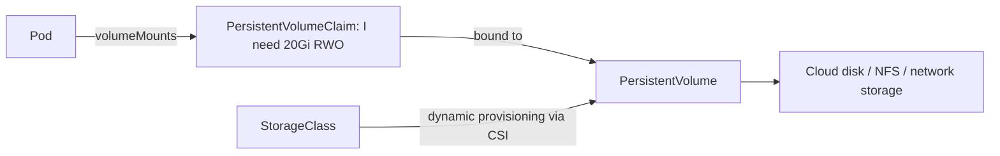

# Docker Handbook — Part 5: Storage

# Chapter 13 — Storage: Volumes, Bind Mounts, tmpfs, and Kubernetes Volumes

## 13.1 Why it exists

Containers are **disposable by design**: remove one and its writable layer is gone. But databases, uploads, and caches need data that **survives** container replacement, and some workloads need fast scratch space that never touches disk. Docker therefore provides storage that lives **outside** the container's layer stack. Kubernetes generalizes the same ideas into volumes, PersistentVolumes, and PersistentVolumeClaims.

## 13.2 How it works

### Three places data can live



| Location | Lifetime | Performance | Use for |
|---|---|---|---|
| **Image layers** | Immutable | Fast reads | Application code and dependencies |
| **Writable layer** | Dies with the container | Slower writes (copy-on-write) | Small temporary files only |
| **Volume / mount** | Independent of the container | Native filesystem speed | Anything that matters |

### The four Docker storage types

| Type | What it is | Managed by | Typical use |
|---|---|---|---|
| **Named volume** | Directory under Docker's data root, referenced by name | Docker | Databases, persistent app data |
| **Anonymous volume** | A volume with a random name (e.g. from `VOLUME`) | Docker | Rarely wanted; easy to orphan |
| **Bind mount** | A specific host path mounted into the container | You | Local development, injecting host files |
| **tmpfs** | In-memory filesystem | Kernel | Secrets or scratch data that must never hit disk |

```bash
docker run -d -v pgdata:/var/lib/postgresql/data postgres:16        # named volume
docker run -d -v $(pwd)/conf:/etc/app:ro myapp                      # bind mount, read-only
docker run -d --tmpfs /tmp:rw,size=64m myapp                        # tmpfs
docker run -d --mount type=volume,src=pgdata,dst=/data myapp        # explicit syntax
```

Behaviors that cause real bugs:

- **Mounts hide what is already there.** Mounting over `/app` makes the image's `/app` content invisible.
- **First-use population:** an *empty named volume* is populated with the image's content at that path on first mount; a *bind mount* is not (the host directory wins, even if empty).
- **Volumes survive `docker rm`.** Only `docker rm -v` or `docker volume rm` deletes them; they accumulate silently.
- **Permissions are numeric.** The container process's UID must be allowed to write to the mounted directory's owner UID. Names do not matter; numbers do.

### The key mapping: Docker to Kubernetes



| Docker | Kubernetes | Persistence | Notes |
|---|---|---|---|
| Named volume | **PersistentVolume + PersistentVolumeClaim** | Survives pod deletion | Provisioned by a **StorageClass** via a CSI driver |
| Bind mount | **`hostPath`** | Tied to one node | Security risk; use only for node agents and system pods |
| tmpfs | **`emptyDir` with `medium: Memory`** | Pod lifetime | **Counts against the container memory limit** |
| Writable layer | **`emptyDir` (default medium)** or the layer itself | Pod lifetime / container lifetime | Counts toward ephemeral-storage |
| `-v file:/etc/app:ro` | **ConfigMap / Secret volume** | Managed by the API | Preferred way to inject config |

### Kubernetes persistent storage in one picture



- **PVC** is the *request*, **PV** is the *actual storage*, **StorageClass** is the *recipe* for creating PVs on demand, **CSI** is the plugin interface to storage backends.
- **Access modes** describe how a volume can be mounted: `ReadWriteOnce` (one node), `ReadWriteMany` (many nodes), `ReadOnlyMany`, and `ReadWriteOncePod` (one pod). Block-disk backends are typically RWO; shared file systems provide RWX.
- **Reclaim policy:** `Delete` removes the backing storage when the PVC is deleted; `Retain` keeps it for manual cleanup.
- **StatefulSets** use `volumeClaimTemplates` to give each replica its own PVC that follows it across restarts.

## 13.3 Kubernetes relationship (beyond the mapping)

- **The image `VOLUME` instruction is not a Kubernetes volume** (Chapter 10). Declare volumes in the pod spec.
- **`securityContext.fsGroup`** makes mounted volumes group-writable for the pod's processes: the usual fix for permission problems on persistent volumes.
- **`readOnlyRootFilesystem: true`** forces apps to write only to mounted volumes. Pair it with an `emptyDir` for `/tmp` and any cache directories.
- **Ephemeral storage** (writable layer, logs, default `emptyDir`) can be limited with `resources.limits.ephemeral-storage`; exceeding it evicts the pod.

## 13.4 How it breaks in production

| Symptom | Likely cause | Fix |
|---|---|---|
| `permission denied` writing to a volume | UID of the process does not match volume ownership | Set `fsGroup` / `runAsUser`, or fix ownership in an init container |
| PVC stuck `Pending` | No default StorageClass, wrong class name, no capacity, or topology mismatch | Check `kubectl describe pvc`, class, and provisioner |
| `Multi-Attach error` / `FailedAttachVolume` | RWO volume still attached to the old node while the pod reschedules | Wait for detach, use correct rollout strategy (`Recreate` or StatefulSet) |
| Pod stuck `ContainerCreating` with `FailedMount` | Backend unreachable, wrong credentials, missing secret/configmap | `kubectl describe pod` events, check CSI driver pods |
| Data gone after restart | Data was in an `emptyDir` or the container layer | Move to a PVC |
| Data gone after deleting a PVC | Reclaim policy `Delete` | Use `Retain` for critical data, back up |
| Pod evicted, no obvious cause | Ephemeral storage exceeded (logs, `emptyDir`, layer writes) | Set limits, rotate logs, move data to PVC |
| Pod OOMKilled using `emptyDir: Memory` | tmpfs usage counts toward the memory limit | Size it deliberately or use disk-backed `emptyDir` |
| ConfigMap update not visible | Mounted with `subPath` (does not auto-update) | Mount the whole directory, or restart the pod |
| Zone issues: pod cannot use its volume | Disk in one zone, pod scheduled in another | `WaitForFirstConsumer` binding mode, topology-aware scheduling |

Full step-by-step decision tree for mount failures: Chapter 19.

> **Production Insight:** Never put a database on `hostPath` or `emptyDir`. Use a PVC with a proper StorageClass, a `Retain` policy for critical data, and **tested backups or snapshots**. Storage that has never been restored from a backup is not a backup.

> **Common Pitfall:** Assuming a bind mount copies the image's existing files into the host directory. It does the opposite: it hides them behind whatever the host directory contains, often an empty directory.

> **Important:** `docker system prune --volumes` and `kubectl delete pvc` (with reclaim `Delete`) are both **destructive for data**. Check what you are deleting.

## 13.5 Interview perspective

1. **Volume vs bind mount?** A volume is managed by Docker under its data root and is portable and persistent; a bind mount maps an arbitrary host path, tightly coupled to the host's layout.
2. **How do Docker storage types map to Kubernetes?** Named volume to PV/PVC, bind mount to `hostPath`, tmpfs to `emptyDir` with `medium: Memory`, and the writable layer to default ephemeral storage.
3. **Explain PV, PVC, StorageClass.** PV is the storage resource, PVC is a pod's request for it, StorageClass defines how to provision PVs dynamically via CSI.
4. **A pod can't write to its mounted volume. What do you check?** UID/GID of the process vs volume ownership, `fsGroup`, read-only mounts, and `readOnlyRootFilesystem`.
5. **Why does a rescheduled pod fail to mount its volume?** An RWO volume is still attached to the previous node (`Multi-Attach`), or the volume is in a different zone than the new node.

> **Interview Tip:** Be ready to say *when* each Kubernetes type is the right choice: `emptyDir` for scratch and sidecar sharing, PVC for state, ConfigMap/Secret volumes for config, and `hostPath` almost never.

---

# Part 5 in 60 Seconds

- Image layers are read-only; the **writable layer dies with the container**; volumes live outside both.
- Docker → Kubernetes: **named volume → PVC/PV**, **bind mount → hostPath**, **tmpfs → emptyDir (Memory)**, **writable layer → ephemeral storage**.
- PVC = request, PV = storage, StorageClass = provisioning recipe, CSI = plugin interface; RWO usually means one node.
- Permission errors are almost always **UID/GID mismatches**: `fsGroup`, `runAsUser`, or init-container chown.
- `emptyDir: Memory` counts against the memory limit; ephemeral storage overruns cause eviction.
