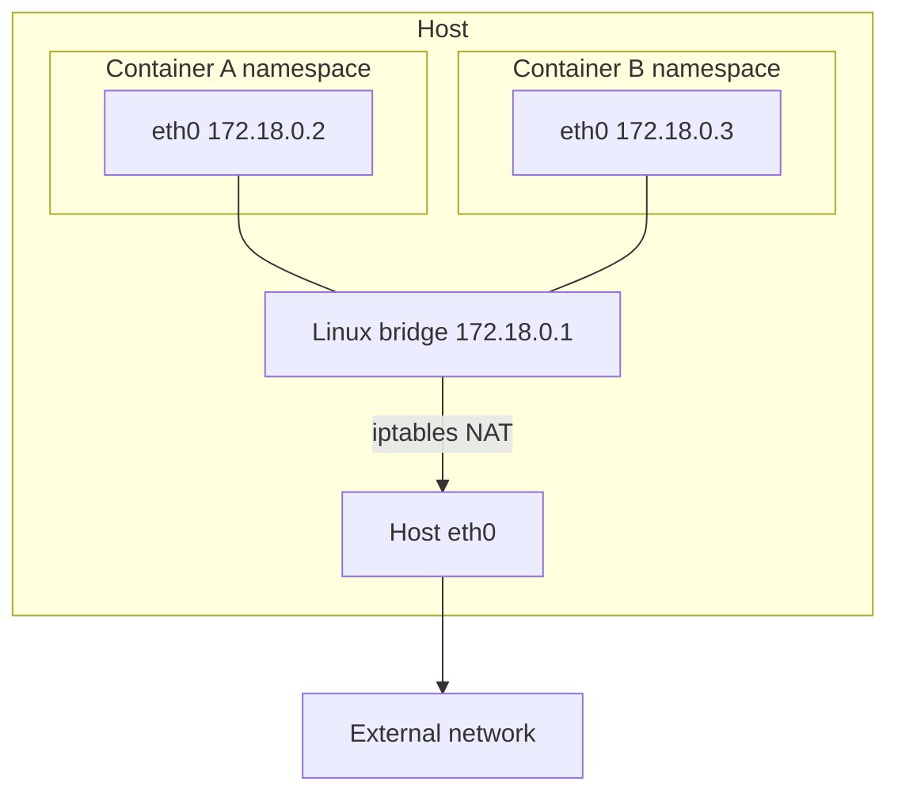
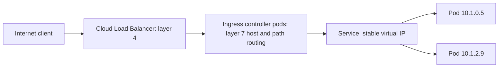

# Docker Handbook — Part 6: Networking

# Chapter 14 — Networking Fundamentals: From Docker Bridge to Kubernetes

## 14.1 Why it exists

A network namespace starts empty: no interfaces, no routes. Containers need to **reach each other, reach the internet, and be reachable**, without every container fighting over host ports. Docker solves this on a single host with a virtual bridge and NAT. Kubernetes must solve it across hundreds of nodes, so it replaces NAT-per-host with a **flat pod network** plus **Services** for stable addressing.

## 14.2 How it works

### Docker bridge networking

By default, Docker creates a Linux **bridge** (a virtual switch) on the host. Each container gets a **veth pair**: one end is `eth0` inside the container's namespace, the other end plugs into the bridge.



Two NAT behaviors do the heavy lifting:

- **Outbound:** container traffic to the internet is **masqueraded** (source IP rewritten to the host's IP).
- **Inbound:** `-p 8080:80` adds a **DNAT** rule: traffic to host port 8080 is redirected to the container's IP on port 80.

```bash
docker network create appnet
docker run -d --name db  --network appnet postgres:16
docker run -d --name api --network appnet -p 8080:8080 myapp
# inside api, "db" resolves to the database container's IP
```

### Network modes that matter

| Mode | Behavior | Use |
|---|---|---|
| **bridge (user-defined)** | Own subnet, **built-in DNS by container name** | Default choice for multi-container apps |
| **bridge (default)** | Shared `docker0`, **no name resolution** between containers | Avoid for anything real |
| **host** | Container shares the host's network namespace | Performance-critical or network tooling; no port isolation |
| **none** | Loopback only | Fully isolated jobs |

Container IPs are **ephemeral**: they change on restart. Never hard-code them; use names (user-defined networks) or Services (Kubernetes).

### DNS inside a container

Docker's embedded DNS (at `127.0.0.11` on user-defined networks) resolves container names and forwards everything else to the host's resolvers. The container's `/etc/resolv.conf` tells you which resolver it is using, which is the first thing to check in any DNS problem.

## 14.3 Kubernetes relationship

### The Kubernetes network model

Kubernetes sets three rules, and a **CNI plugin** implements them:

1. Every pod gets **its own IP**.
2. Any pod can reach any other pod **by IP without NAT**, across nodes.
3. Nodes can reach all pods.

The CNI plugin does the equivalent of Docker's veth-and-bridge setup (plus routing, an overlay such as VXLAN, or eBPF) so that this holds cluster-wide. The kubelet calls it when the runtime creates the pod sandbox (Chapter 4).

### How Docker concepts evolve

| Docker | Kubernetes | What changed |
|---|---|---|
| Bridge network (single host) | Pod network via CNI (cluster-wide) | Flat, routable pod IPs across nodes |
| Container IP | Pod IP | Still ephemeral |
| Container name via embedded DNS | **Service name via CoreDNS** | Stable name plus stable virtual IP |
| `-p host:container` (DNAT) | **Service** (NodePort / LoadBalancer) and **Ingress** | Load balanced, many backends |
| `--network host` | `hostNetwork: true` | Same trade-offs |
| iptables NAT rules by Docker | iptables/IPVS/eBPF rules by **kube-proxy** or the CNI | Implements Services |
| Compose service name | Service name | Same idea, now with load balancing |
| Container-to-container on a network | **NetworkPolicy** | Pods are open by default; policies restrict |

### Services: stable addresses over changing pods

A **Service** gives a set of pods (selected by labels) one stable virtual IP and DNS name. Traffic to that IP is load-balanced across ready pod IPs by rules programmed on every node.

| Service type | Reachable from | Notes |
|---|---|---|
| **ClusterIP** (default) | Inside the cluster | Internal service-to-service traffic |
| **NodePort** | `<nodeIP>:<port>` | Building block; rarely exposed directly |
| **LoadBalancer** | Cloud load balancer IP | Layer 4 external entry |
| **Headless** (`clusterIP: None`) | DNS returns pod IPs directly | StatefulSets, client-side balancing |

### The full external traffic path



Each hop does one job: the **load balancer** brings traffic into the cluster, the **Ingress controller** routes by hostname and path and terminates TLS, the **Service** picks a healthy pod, and the **pod's network namespace** receives it on its port.

### Cluster DNS

Pods resolve `my-svc` (same namespace), `my-svc.team-a`, or the full `my-svc.team-a.svc.cluster.local` through CoreDNS. Pod `/etc/resolv.conf` contains a **search path** and `ndots:5`, meaning any name with fewer than five dots is tried with each search suffix first. That makes external lookups like `api.example.com` generate several extra queries; use fully qualified names (trailing dot) or tune `dnsConfig` for latency-sensitive paths.

## 14.4 How it breaks in production

| Symptom | Likely cause | Check / fix |
|---|---|---|
| Works inside the container, unreachable from outside | App listens on `127.0.0.1`, not `0.0.0.0` | `ss -tlnp` inside the container; bind to `0.0.0.0` |
| Container-to-container name fails (Docker) | Using the default bridge, which has no DNS | Use a user-defined network |
| Service reachable but returns nothing | **No endpoints**: label selector mismatch, or pods not Ready | `kubectl get endpoints <svc>`, check selector and readiness |
| Connection refused through Service | Wrong `targetPort`, or app not listening on that port | Compare Service `targetPort` with container port |
| Intermittent DNS failures or slow lookups | CoreDNS overloaded, `ndots:5` amplification, conntrack/UDP issues | Check CoreDNS pods, use FQDNs, NodeLocal DNSCache |
| Pods cannot talk to each other | **NetworkPolicy** default deny, or CNI problems | `kubectl get networkpolicy`; verify CNI pods healthy |
| `failed to create pod sandbox` | CNI plugin not ready or IP pool exhausted | Check CNI pods and node IP allocation |
| Ingress returns **502 / 503 / 504** | 502: bad backend response; 503: no healthy backends; 504: backend timeout | Check endpoints, readiness probes, and timeouts |
| Large requests hang, small ones work | MTU mismatch with overlay networks | Align MTU across CNI and underlay |
| Client IP lost in logs | NAT / `externalTrafficPolicy` and proxy hops | Use `X-Forwarded-For` or `externalTrafficPolicy: Local` |
| Random connection drops under load | Conntrack table full | Raise conntrack limits, reduce short-lived connections |

The step-by-step DNS failure decision tree is in Chapter 19.

### Fast debugging toolkit

```bash
# Docker
docker network inspect appnet
docker exec api sh -c 'cat /etc/resolv.conf; nslookup db'

# Kubernetes
kubectl exec -it <pod> -- sh -c 'ss -tlnp; nslookup my-svc; curl -sv http://my-svc:80'
kubectl get svc,endpoints my-svc
kubectl get networkpolicy -A
# From the node: the rules kube-proxy created
sudo iptables -t nat -L -n | grep my-svc
```

> **Production Insight:** When "the network is broken," walk the path in order: **process listening → pod IP → Service endpoints → Service DNS → Ingress/LB**. Most incidents are found in the first three, and are not network failures at all but selector, readiness, or bind-address mistakes.

> **Common Pitfall:** An app bound to `127.0.0.1` works perfectly with `docker exec curl localhost` and is unreachable from everywhere else. Always bind servers to `0.0.0.0` in containers.

> **Important:** `EXPOSE` and `containerPort` are documentation only (Chapter 10). Traffic reaches a pod only if the app listens on the port and a Service or publish rule routes to it.

## 14.5 Interview perspective

1. **How does a container reach the internet?** Through its veth pair to the bridge, then the host's NAT (masquerade) out of the host interface.
2. **Default bridge vs user-defined bridge?** User-defined has automatic DNS resolution by container name and better isolation; the default bridge has no name resolution.
3. **What are the Kubernetes networking rules?** Every pod has its own IP; pods reach each other without NAT; nodes reach pods. A CNI plugin implements this.
4. **Trace a request from the internet to a pod.** Load balancer, Ingress controller (host/path routing), Service (virtual IP selects a ready endpoint), pod IP and port.
5. **A Service exists but returns connection errors. What do you check?** Endpoints (selector and readiness), `targetPort`, whether the app binds `0.0.0.0`, and NetworkPolicy.

> **Interview Tip:** Show you understand *why* Services exist: pod IPs are ephemeral, so a stable virtual IP and DNS name sit in front of them. This connects directly back to Docker's "container IPs change on restart" problem.

---

# Part 6 in 60 Seconds

- Docker: **veth pair → bridge → iptables NAT**; `-p` is a DNAT rule; user-defined bridges give DNS by name.
- Kubernetes: **one IP per pod, no NAT between pods**, implemented by a **CNI plugin**.
- **Services** give stable IPs and DNS over ephemeral pods; **Ingress** adds layer 7 routing; the **load balancer** is the cluster's front door.
- Path: `Internet → LB → Ingress → Service → Pod`.
- Most "network" incidents are really **no endpoints, wrong targetPort, 127.0.0.1 binding, NetworkPolicy, or DNS (ndots)**.
