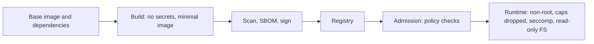

# Docker Handbook — Part 7: Security

# Chapter 15 — Security Fundamentals

## 15.1 Why it exists

Containers share the host kernel, so a mistake inside a container can become a mistake on the **host**. Security is therefore **defense in depth**: no single control is trusted, and each layer limits the damage when another fails. The goal is to make a compromised container as **useless to an attacker** as possible: unprivileged, unable to write, unable to escalate, with nothing valuable inside.

## 15.2 How it works

### Where security applies



| Phase | Primary risks | Controls |
|---|---|---|
| **Image / supply chain** | Vulnerable packages, malicious base images, tampered images | Minimal base, scanning, SBOM, signing, pin by digest |
| **Build** | Secrets in layers, over-privileged builders | BuildKit secret mounts, rootless/daemonless builders |
| **Runtime** | Root, excess capabilities, container escape | Hardening settings below |
| **Orchestrator** | Over-permissive pods, lateral movement | Pod Security, NetworkPolicy, RBAC, policy engines |

### The runtime hardening set

| Control | What it does | Docker flag | Kubernetes field |
|---|---|---|---|
| **Non-root user** | Compromise does not equal root in the container | `--user 10001` | `runAsNonRoot: true`, `runAsUser` |
| **Drop capabilities** | Removes fine-grained root powers (e.g. `NET_RAW`, `SYS_ADMIN`) | `--cap-drop ALL --cap-add ...` | `capabilities.drop: ["ALL"]` |
| **No privilege escalation** | Blocks setuid-style gains | `--security-opt no-new-privileges` | `allowPrivilegeEscalation: false` |
| **Read-only root filesystem** | Attacker cannot drop tools or modify binaries | `--read-only --tmpfs /tmp` | `readOnlyRootFilesystem: true` + `emptyDir` |
| **Seccomp** | Filters allowed system calls | Default profile applied | `seccompProfile: RuntimeDefault` |
| **AppArmor / SELinux** | Mandatory access control confining file and resource access | `--security-opt` | Profiles / SELinux options |
| **Never privileged** | `privileged` removes nearly all isolation (all capabilities, all devices) | avoid `--privileged` | `privileged: false` |
| **User namespaces / rootless** | Container root maps to unprivileged host UID | Rootless mode | `hostUsers: false` where supported |

> **Important:** A **privileged** container is close to **root on the host**. Likewise, mounting the Docker socket (`/var/run/docker.sock`) into a container hands it control of the daemon. Treat both as red flags in review.

### A hardened pod

```yaml
spec:
  securityContext:
    runAsNonRoot: true
    runAsUser: 10001            # numeric (Chapter 10)
    fsGroup: 10001              # volume write access (Chapter 13)
    seccompProfile:
      type: RuntimeDefault
  containers:
    - name: app
      image: registry.example.com/team/app@sha256:9f86d0...   # digest (Chapter 7)
      securityContext:
        allowPrivilegeEscalation: false
        readOnlyRootFilesystem: true
        capabilities:
          drop: ["ALL"]
      volumeMounts:
        - { name: tmp, mountPath: /tmp }
  volumes:
    - { name: tmp, emptyDir: {} }
```

### Secrets handling

| Where | Problem |
|---|---|
| In an image layer | Recoverable by anyone with the image, even if deleted later (Chapter 7) |
| `ENV` / `ARG` | Visible in `docker inspect`, `docker history`, and `/proc/<pid>/environ` |
| Build-time need (private package token) | Use **BuildKit secret mounts**, which never persist in a layer |
| Kubernetes Secret | Base64-encoded, **not encrypted by default**: enable encryption at rest, restrict RBAC |
| Best option | External secret managers synced or mounted at runtime |

```dockerfile
# Secret available only during this RUN, not stored in any layer
RUN --mount=type=secret,id=npmrc,target=/root/.npmrc npm ci
```

```bash
docker build --secret id=npmrc,src=$HOME/.npmrc .
```

### Supply chain: scan, SBOM, sign

- **Scanning** (Trivy, Grype, or registry-native scanners) finds known CVEs in OS packages and dependencies. Run in CI **and** re-scan stored images regularly, because new CVEs appear after build.
- **SBOM** (software bill of materials, SPDX or CycloneDX) is the inventory of what is inside an image, which makes "are we affected by CVE-X?" answerable in minutes.
- **Signing** (e.g. Cosign/Sigstore) proves who built an image and that it is unmodified; an admission policy then **rejects unsigned images**.
- **Reduce the surface first:** minimal and distroless bases (Chapter 9) remove most findings before scanning even starts.

### Kubernetes admission and policy

- **Pod Security Standards** define three levels: *privileged*, *baseline*, *restricted*. **Pod Security Admission** enforces them per namespace. The *restricted* level requires non-root, dropped capabilities, no privilege escalation, and a seccomp profile.
- **Policy engines** (Kyverno, OPA Gatekeeper) enforce custom rules: allowed registries, no `latest`, required signatures, required limits.
- **NetworkPolicy** (Chapter 14) limits lateral movement; **RBAC** and disabling unneeded service account token mounting limit what a compromised pod can do to the API.

## 15.3 OpenShift behavior: arbitrary UIDs and SCCs

OpenShift enforces a stricter default than vanilla Kubernetes, and this is the most common reason **"it works on Docker, fails on OpenShift."**

### How it differs

| Concept | Behavior |
|---|---|
| **Security Context Constraints (SCC)** | Cluster-level policy objects that decide what a pod may do (run as root, privileged, host access, capabilities, volumes). At admission, OpenShift picks an SCC the pod's service account is allowed to use. |
| **Default `restricted` SCC** | Non-root only, no privileged mode, capabilities dropped, no host access, SELinux labels applied |
| **Arbitrary UID** | The pod runs as a **random UID from a range assigned to the namespace**, **ignoring the image's `USER`**. The group is **GID 0 (root group)** |
| **Why GID 0** | The platform cannot know the UID in advance, so it gives the process membership of the root *group*, which is unprivileged but can be granted file access |

### Why many Docker images fail

| Failure | Cause | Fix in the image |
|---|---|---|
| `Permission denied` writing to `/var/log`, `/var/cache`, `/app/data` | Directories owned by a fixed UID or root with mode `755`; the random UID has no write access | `chgrp -R 0 /app && chmod -R g=u /app` (group gets the same permissions as the owner) |
| Container refuses to start or exits immediately | Image requires **root** (or `USER root` at runtime) | Build to run unprivileged |
| `bind: permission denied` on port 80 or 443 | No `NET_BIND_SERVICE` capability for a non-root user | Listen on an unprivileged port (e.g. 8080) and let the Service map it |
| `whoami: cannot find name for user ID 1000670000` or tools failing | No `/etc/passwd` entry for the random UID | Make `/etc/passwd` group-writable and add an entrypoint step, or use `nss_wrapper` |
| Entrypoint runs `chown`, `su`, `gosu`, or `sudo` | Cannot change user at runtime | Remove user switching; set ownership at build time |
| `unable to validate against any security context constraint` | Pod asks for something the SCC forbids (privileged, `hostPath`, fixed `runAsUser` outside the range) | Fix the pod spec; do not widen permissions casually |

> **Common Pitfall:** "Fixing" an OpenShift failure by granting the `anyuid` or `privileged` SCC to a service account. It works, and it silently removes the platform's protection. Fix the **image** instead.

**Design rule for portable images:** make them **run correctly as any non-root UID** by (1) using numeric `USER`, (2) giving GID 0 the same permissions as the owner on writable paths, (3) using high ports, and (4) never relying on runtime `chown` or fixed users. Such an image runs unchanged on Docker, vanilla Kubernetes, and OpenShift.

## 15.4 How it breaks in production

- **Privileged pod or docker.sock mounted** in a "temporary" debugging deployment that is never removed.
- **Secret committed into an image layer** and pushed to a registry, then needs full rotation.
- **`latest` tag, unscanned** image deployed; later CVE discovered with no inventory of where it runs.
- **Writable root filesystem** lets an attacker download and run tooling.
- **Default service account token mounted** in pods that never call the API.
- **`runAsNonRoot` rejection:** `USER` given as a name, not a UID (Chapter 10).
- **`readOnlyRootFilesystem` breaks the app:** it writes to `/tmp`, a cache, or a PID file; add `emptyDir` mounts for those paths.
- **CVE alert fatigue:** hundreds of findings from a fat base image; fix by shrinking the base, then triage by exploitability and fix availability.

> **Production Insight:** Start from **restricted** and relax only with a written reason. Teams that begin permissive almost never tighten later, because every tightening breaks something nobody remembers.

> **Common Pitfall:** Treating `docker scan` or a CI scan as "security done." A clean scan only covers *known* CVEs in *known* packages at *one point in time*.

## 15.5 Interview perspective

1. **How would you secure a container in production?** Non-root numeric user, drop all capabilities, no privilege escalation, read-only root filesystem, seccomp default, minimal base image, no secrets in the image, resource limits, NetworkPolicy.
2. **Why is `--privileged` dangerous?** It grants all capabilities and device access and disables much of the confinement, so the container is nearly root on the host.
3. **How do you handle secrets in a Docker build?** Never `ENV`/`ARG`/`COPY`; use BuildKit secret mounts. At runtime use Kubernetes Secrets with encryption at rest or an external secret manager.
4. **Why do many Docker images fail on OpenShift?** OpenShift's restricted SCC runs containers as a random non-root UID with GID 0; images that need root, fixed ownership, or low ports break. Fix by making writable paths group-accessible (`g=u`), using high ports, and avoiding runtime user switching.
5. **What is an SCC and how does it relate to Kubernetes?** A cluster policy controlling pod privileges; conceptually similar to Pod Security Standards, but more granular and applied per service account.
6. **How do you prevent untrusted images from running?** Sign images (Cosign), enforce verification and allowed registries via admission policy, and pin by digest.

> **Interview Tip:** Structure answers as **image → build → registry → admission → runtime**. It shows you think in layers, and gives interviewers an easy path to ask follow-ups.

---

# Part 7 in 60 Seconds

- A container is **not** a security boundary by itself; layer the controls.
- Runtime baseline: **numeric non-root, `cap-drop ALL`, no privilege escalation, read-only rootfs, RuntimeDefault seccomp, never privileged, never mount docker.sock.**
- Secrets never go in layers, `ENV`, or `ARG`; use BuildKit secret mounts and a real secret store.
- Supply chain: **minimal base → scan → SBOM → sign → admission verifies**.
- Kubernetes enforces via **Pod Security Standards (restricted)**, policy engines, NetworkPolicy, and RBAC.
- OpenShift: **random UID + GID 0, restricted SCC**. Portable images use `chmod g=u`, high ports, and no runtime user switching.

**Next: Part 8 — Registries and CI/CD** (Ch 16 Registries and Image Lifecycle · Ch 17 CI/CD Patterns).