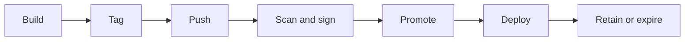
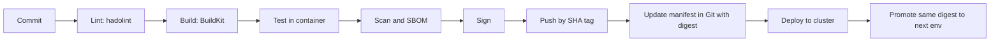

# Docker Handbook — Part 8: Registries and CI/CD

# Chapter 16 — Registries and Image Lifecycle

## 16.1 Why it exists

An image is useless if it cannot reach the nodes that must run it. A **registry** is the server that stores and distributes images (it implements the OCI distribution spec). In production the registry is a **critical dependency**: if nodes cannot pull, new pods, autoscaling, and node replacement all fail, even when the cluster itself is healthy.

## 16.2 How it works

### Anatomy of an image reference

```
registry.example.com:443 / team / app : 1.4.2
        registry            repo     tag
registry.example.com/team/app@sha256:9f86d0...     <- by digest
```

If the registry host is omitted, Docker assumes Docker Hub. Always use the **full name** in manifests so nothing is ambiguous.

| Registry type | Examples | Typical use |
|---|---|---|
| Public | Docker Hub, GHCR | Base images, open source |
| Cloud-managed | ECR, ACR, GCR / Artifact Registry | Production images close to the cluster; IAM integration |
| Self-hosted / artifact managers | Harbor, Nexus, Artifactory | Private control, scanning, replication, proxy cache |

### Authentication

- **Docker:** `docker login registry.example.com` stores credentials in `~/.docker/config.json`.
- **Kubernetes:** the kubelet needs credentials for private registries via:
  - an **`imagePullSecrets`** reference (a Secret of type `kubernetes.io/dockerconfigjson`), attached to the pod or its ServiceAccount, or
  - **cloud identity** (node or workload IAM roles / credential providers), which avoids long-lived passwords.

```bash
kubectl create secret docker-registry regcred \
  --docker-server=registry.example.com \
  --docker-username=<user> --docker-password=<token> -n team-a
```

> **Important:** Pull secrets are **namespace-scoped**. A secret in `team-a` does nothing for a pod in `team-b`.

### Image lifecycle



### Tagging strategy

| Practice | Why |
|---|---|
| **Unique immutable tag per build** (git SHA, or semver at release) | Always know exactly what runs |
| **Deploy by digest** where possible | Content-addressed (Chapter 7) |
| **Promote, don't rebuild:** the artifact tested in staging is the one retagged or referenced in production | A rebuild is a *different* artifact |
| Avoid `latest` in any deployment | Mutable, ambiguous, and changes `imagePullPolicy` behavior |
| Enable **tag immutability** in the registry | Prevents silently overwritten releases |
| Define **retention policy** | Controls storage cost, but see failure notes below |

### Rate limits, mirrors, and replication

Public registries **rate-limit pulls**, especially anonymous or free-tier. A cluster scaling out can hit this quickly, because every new node pulls the same base images. Remedies: authenticate pulls, use a **pull-through cache / mirror** in your own registry, and **replicate** critical images across regions.

## 16.3 Kubernetes relationship

### `imagePullPolicy`

| Policy | Behavior | Default when |
|---|---|---|
| `IfNotPresent` | Pull only if not cached on the node | Tag is specific (or a digest) |
| `Always` | Check the registry on every start (cached layers still reused) | Tag is `latest` or omitted |
| `Never` | Never pull | Explicit only |

### Pull failure lifecycle

A failed pull shows as **`ErrImagePull`**, then **`ImagePullBackOff`** as the kubelet retries with increasing delay (capped at about five minutes). The reason is always in `kubectl describe pod` under Events.

| Event message (typical) | Likely cause | Fix |
|---|---|---|
| `not found` / `manifest unknown` | Typo, wrong tag, or tag deleted by retention | Verify the exact reference exists in the registry |
| `unauthorized` / `401` / `403` | Missing or wrong pull secret, expired token, or IAM permission | Check `imagePullSecrets`, namespace, credentials, role |
| `toomanyrequests` / `429` | Registry rate limit | Authenticate, mirror, cache |
| `x509: certificate signed by unknown authority` | Private registry with a CA the node does not trust | Install the CA on nodes / runtime config |
| `no matching manifest for linux/amd64` | Image built for a different architecture (Chapter 1, Chapter 7) | Build multi-arch |
| `i/o timeout`, `no such host`, `connection refused` | DNS, firewall, proxy, or registry outage | Test from the node (`crictl pull`), check egress |
| Pull succeeds but pod runs old code | Mutable tag with `IfNotPresent` | Unique tags or digests |

The step-by-step decision tree is in Chapter 19.

## 16.4 How it breaks in production

- **Autoscaling stalls:** registry outage or throttling means new nodes cannot pull images.
- **Retention policy deletes an image still in use:** a pod reschedules weeks later and gets `manifest unknown`; **rollback becomes impossible** because the previous version is gone.
- **Mutable tag overwritten:** two builds push the same tag; nodes run different content.
- **Huge images:** slow cold starts, pull timeouts under load (Chapter 9).
- **Expired credentials:** pull secrets or tokens rotate, and only *new* pods fail, so the incident surfaces hours later.
- **Single-region registry** becomes a single point of failure.

> **Production Insight:** Retention rules should keep **every image referenced by a running workload and the last N releases**. Never let a retention job decide purely by age.

> **Common Pitfall:** Creating `imagePullSecrets` in one namespace and expecting it to work cluster-wide.

## 16.5 Interview perspective

1. **What does a registry do?** Stores and serves OCI images (manifests, configs, layers), with authentication and access control.
2. **A pod is in `ImagePullBackOff`. What do you check?** `kubectl describe pod` events: the reference and tag, pull secret and namespace, credentials, rate limits, network from the node, architecture.
3. **Why promote an image instead of rebuilding per environment?** A rebuild is a different artifact; promotion guarantees production runs exactly what was tested.
4. **How do you avoid Docker Hub rate limits?** Authenticated pulls, a pull-through cache or mirror, and pre-pulling or replicating base images.
5. **What is a good tagging strategy?** Immutable unique tags (SHA/semver), digests in manifests, no `latest`, retention that protects running and recent releases.

---

# Chapter 17 — CI/CD Patterns

## 17.1 Why it exists

The CI/CD pipeline is where images are **born**. A good pipeline produces a **single, tested, scanned, signed, immutable artifact** and moves that same artifact through environments. Most Docker pain in teams (slow builds, flaky pipelines, unreproducible deployments, security gaps) comes from pipeline design, not Docker itself.

## 17.2 How it works

### The reference pipeline



Each stage is a **gate**: failing lint, tests, or scan blocks the push.

### BuildKit and buildx: the modern builder

BuildKit is the default build engine in current Docker. It builds independent stages in parallel and adds features that matter in CI:

| Feature | Use |
|---|---|
| **Cache mounts** `RUN --mount=type=cache` | Persist package manager caches (pip, npm, Maven) between builds **without** putting them in the image |
| **Secret mounts** `RUN --mount=type=secret` | Private tokens during build, never stored in a layer (Chapter 15) |
| **Remote cache** import/export | Warm cache on ephemeral runners (Chapter 8) |
| **Multi-platform** via `buildx` | One command builds `amd64` and `arm64` into one tag |

```dockerfile
RUN --mount=type=cache,target=/root/.cache/pip pip install -r requirements.txt
```

```bash
docker buildx build --platform linux/amd64,linux/arm64 \
  -t registry.example.com/team/app:${GIT_SHA} --push .
```

### Building images when there is no Docker daemon

Kubernetes-based runners usually **have no Docker daemon** (containerd nodes, Chapter 4). Options:

| Approach | How it works | Verdict |
|---|---|---|
| **Mount the host Docker socket** | Pipeline container talks to the host daemon | **Avoid:** root-equivalent on the node (Chapter 5, Chapter 15); also **does not work** on containerd nodes |
| **Docker-in-Docker (DinD)** | A Docker daemon inside the pipeline container | Requires a **privileged** container; flaky, slow cache, risky |
| **Daemonless builders** (Kaniko, Buildah, BuildKit rootless) | Build an image from a Dockerfile without a daemon, often unprivileged | **Preferred** in clusters |
| **Remote builder** | Pipeline sends the build to a dedicated BuildKit service | Strong caching and isolation |

> **Important:** Check the **current maintenance status** of any builder you adopt. The tooling landscape here changes, and a project that was the default two years ago may have been archived or forked.

### Why the Docker socket is dangerous in CI

Anyone who can run a pipeline step with the socket mounted can start a privileged container that mounts the node's filesystem. A malicious or compromised dependency in a build step then owns the **node**, and everything else running on it, including other teams' pods and credentials.

### Tagging and promotion in the pipeline

- Tag every build with the **git SHA**; add a **semver** tag on release.
- Record the pushed **digest**, and use it in deployment manifests.
- Promote by **referencing or retagging the same digest**, never by rebuilding.
- With **GitOps** (Argo CD, Flux), a deploy is a Git commit changing the image reference; **rollback is reverting that commit** to the previous digest.

### Pipeline credentials

Use **short-lived credentials** (OIDC federation or workload identity) to push to the registry instead of long-lived static passwords stored in CI variables. Give push access only to the pipeline, and pull-only access to clusters.

## 17.3 Kubernetes relationship

- The pipeline outputs a **digest**; the Kubernetes manifest (Deployment) consumes it. The boundary between CI and CD is that image reference.
- **Rollouts** (rolling update, probes, `maxUnavailable`) are only as safe as the image's startup and shutdown behavior (Chapter 11).
- **Admission policies** (Chapter 15) re-verify at deploy time what CI claimed: signature present, registry allowed, no `latest`.
- Integration tests can run with **Compose** in CI (Chapter 6) or against an ephemeral namespace or cluster.

## 17.4 How it breaks in production

| Symptom | Likely cause | Fix |
|---|---|---|
| Builds take 10+ minutes, local takes seconds | Cold cache on ephemeral runners | Remote cache, cache mounts, or a persistent builder |
| Random 429 or pull failures in CI | Base image rate limits | Authenticate, mirror base images |
| DinD pipelines flake or need privileged mode | DinD design limits | Move to a daemonless or remote builder |
| "Works in CI, wrong arch in prod" (or reverse) | Built on one CPU architecture, deployed on another | Multi-platform build |
| Production runs different code than staging | Rebuilt per environment, or mutable tags | Promote the same digest |
| Cannot roll back | Old images garbage-collected, or no digest recorded | Retention for released versions; store digests in Git |
| Runner disk full | Accumulated cache, images, and volumes | Scheduled `docker builder prune` / ephemeral runners |
| Secrets in build logs or image | `ARG`/`ENV` tokens, verbose logging | Secret mounts, masked variables |
| Vulnerable image reaches production | Scan was a report, not a gate | Fail the pipeline on defined severity thresholds |
| Concurrent builds overwrite a tag | Reused tags like `main` or `latest` | Unique SHA tags |

> **Production Insight:** Treat the pipeline definition as production code: reviewed, versioned, and with **least-privilege credentials**. A compromised pipeline is a compromised production.

> **Common Pitfall:** Rebuilding the image in the "deploy to prod" job "to be safe." It produces a new, untested artifact and breaks traceability.

## 17.5 Interview perspective

1. **How do you build Docker images in a Kubernetes-based CI without the Docker socket?** Daemonless/rootless builders (Kaniko, Buildah, BuildKit) or a remote BuildKit service; avoid DinD and socket mounting for security.
2. **Why is mounting `/var/run/docker.sock` dangerous?** It grants control of the host daemon, which means root-equivalent access to the node.
3. **How do you speed up image builds in CI?** Stable-first layer order, `.dockerignore`, BuildKit cache mounts, registry-based remote cache, smaller bases.
4. **Describe a secure image pipeline.** Lint, build, test in container, scan, SBOM, sign, push with short-lived credentials, deploy by digest, admission verifies signature.
5. **How do you roll back a bad release?** Revert the manifest to the previous image digest (via GitOps or `kubectl rollout undo`), which requires that old images still exist in the registry.
6. **How do you build for both amd64 and arm64?** `docker buildx build --platform ...` producing a multi-arch image index under one tag.

> **Interview Tip:** Say "build once, promote the same digest" early. It signals you understand reproducibility, traceability, and safe rollbacks, which is what pipeline questions are really probing.

---

# Part 8 in 60 Seconds

- A registry is a **critical dependency**: pull failures block scaling. Know the `ImagePullBackOff` causes: **typo/tag, auth (namespace-scoped secret), rate limit, TLS CA, architecture, network**.
- Tag immutably (SHA/semver), **deploy by digest**, **promote, don't rebuild**, retain what is running plus recent releases.
- Defaults: tag `latest` or none means `Always`; specific tag means `IfNotPresent`.
- BuildKit gives cache mounts, secret mounts, remote cache, and multi-arch.
- In-cluster builds: **daemonless builders**; avoid **docker.sock** and **DinD**.
- Pipelines are gates: lint, test, scan, sign; credentials short-lived; rollback = previous digest.
