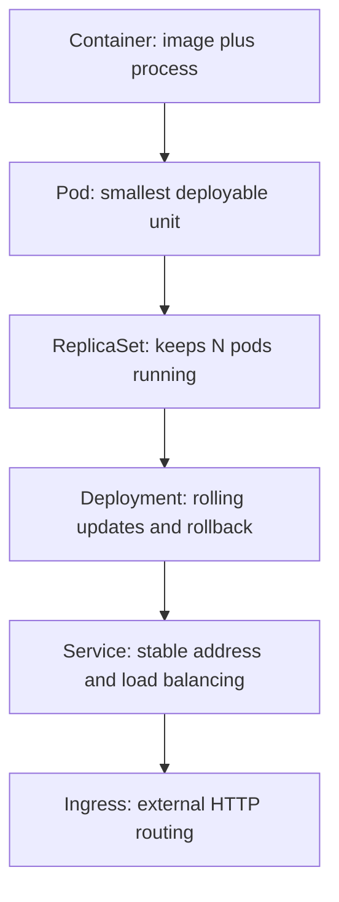
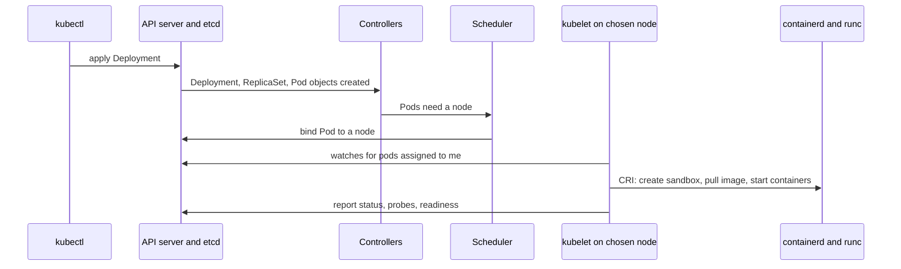

# Docker Handbook — Part 9: Docker ↔ Kubernetes

# Chapter 18 — Docker to Kubernetes Mapping

## 18.1 Why it exists

Docker answers: *"run this container on this machine."* Kubernetes answers: *"keep this desired state true across a fleet of machines, forever."* Most of what trips up Docker-trained engineers is not new syntax but a **change of model**.

| | Docker | Kubernetes |
|---|---|---|
| Scope | One host | A cluster of nodes |
| Style | Imperative: `docker run` | Declarative: describe desired state, controllers reconcile |
| Unit | Container | **Pod** (one or more containers sharing network and IPC namespaces) |
| Failure handling | Restart policy on the same host | Controllers **recreate** pods, possibly on other nodes |
| Networking | Bridge plus published ports | Flat pod network plus **Services** |
| Persistence | Volumes on the host | PV/PVC via StorageClass and CSI |
| Config / secrets | `-e`, `--env-file` | ConfigMaps and Secrets |

## 18.2 How it works

### The abstraction ladder



A **bare Pod is not self-healing**: if its node dies, it is gone. A **Deployment** (via a ReplicaSet) is what gives you the "always running" behavior Docker's `--restart` only approximated on one host.

### What happens when you `kubectl apply` (instead of `docker run`)



Everything Docker did in one daemon is split across components: **scheduler** (placement), **controllers** (replica count, rollouts), **kubelet** (start/stop, probes, restarts on that node), **runtime** (containerd and runc, Chapter 4), **CNI** (networking, Chapter 14), **CSI** (storage, Chapter 13).

### Master mapping: `docker run` flags to Pod spec

| Docker | Kubernetes |
|---|---|
| `image` | `containers[].image` (prefer a digest) |
| `--name` | `metadata.name` (pod) / `containers[].name` |
| ENTRYPOINT / CMD (`--entrypoint`) | `command` / `args` (Chapter 11) |
| `-e KEY=val` | `env` |
| `--env-file` | `envFrom` (ConfigMap or Secret) |
| `-p host:container` | **Service** (and Ingress); `containerPort` is documentation |
| `-v name:/path` | `volumes` + `volumeMounts` (PVC) (Chapter 13) |
| `-v host:/path` (bind) | `hostPath` (avoid) |
| `--tmpfs` | `emptyDir` with `medium: Memory` |
| `--memory`, `--cpus` | `resources.limits` (and **requests**, which Docker has no equivalent for) (Chapter 3) |
| `--restart` | `restartPolicy` on the pod, plus **controllers** for rescheduling |
| `--health-cmd` | `livenessProbe`, `readinessProbe`, `startupProbe` (Dockerfile `HEALTHCHECK` is ignored) |
| `--user` | `securityContext.runAsUser` / `runAsNonRoot` |
| `--read-only` | `securityContext.readOnlyRootFilesystem` |
| `--cap-drop` / `--cap-add` | `securityContext.capabilities` |
| `--privileged` | `securityContext.privileged` (avoid) |
| `--network host` | `hostNetwork: true` |
| `--network` / DNS by name | Pod network (CNI) and **Service DNS** |
| `--pull` | `imagePullPolicy` |
| `-w` | `workingDir` |
| `--label` | `metadata.labels` |
| `--add-host` | `hostAliases` |
| `--init` | `shareProcessNamespace` or an init binary like tini (Chapter 11) |
| `docker stop` timeout | `terminationGracePeriodSeconds` |

### Command mapping

| Docker | Kubernetes |
|---|---|
| `docker ps` | `kubectl get pods` |
| `docker logs -f` | `kubectl logs -f` |
| `docker exec -it` | `kubectl exec -it` / `kubectl debug` |
| `docker inspect` | `kubectl describe` / `-o yaml` |
| `docker stats` | `kubectl top` |
| `docker events` | `kubectl get events` |
| `docker rm -f` | `kubectl delete pod` (a controller then recreates it) |
| On the node: `docker ps` | `crictl ps` (Chapter 4) |

## 18.3 Comparison 1: `docker run` to a Pod manifest

**Docker:**

```bash
docker run -d --name api \
  -p 8080:8080 \
  -e LOG_LEVEL=info --env-file app.env \
  -v apidata:/data \
  --memory 512m --cpus 0.5 \
  --restart unless-stopped \
  --user 10001 --read-only --tmpfs /tmp --cap-drop ALL \
  --health-cmd "curl -f http://localhost:8080/health || exit 1" \
  registry.example.com/team/api:1.4.2
```

**Kubernetes (Pod):**

```yaml
apiVersion: v1
kind: Pod
metadata:
  name: api
  labels: { app: api }
spec:
  restartPolicy: Always                       # --restart
  securityContext:
    runAsNonRoot: true
    runAsUser: 10001                          # --user
  containers:
    - name: api
      image: registry.example.com/team/api:1.4.2
      ports:
        - containerPort: 8080                 # documentation; -p has NO pod-level equivalent
      env:
        - { name: LOG_LEVEL, value: info }    # -e
      envFrom:
        - configMapRef: { name: api-config }  # --env-file
      resources:
        requests: { cpu: 250m, memory: 384Mi }   # new: scheduling guarantee
        limits:   { cpu: 500m, memory: 512Mi }   # --cpus / --memory
      readinessProbe:                         # --health-cmd (readiness: receive traffic?)
        httpGet: { path: /health, port: 8080 }
      livenessProbe:                          # restart if unhealthy
        httpGet: { path: /health, port: 8080 }
      securityContext:
        readOnlyRootFilesystem: true          # --read-only
        allowPrivilegeEscalation: false
        capabilities: { drop: ["ALL"] }       # --cap-drop
      volumeMounts:
        - { name: data, mountPath: /data }    # -v apidata:/data
        - { name: tmp,  mountPath: /tmp }     # --tmpfs /tmp
  volumes:
    - name: data
      persistentVolumeClaim: { claimName: apidata }
    - name: tmp
      emptyDir: { medium: Memory }
```

**What did not carry over, and why it matters:**

- **`-p 8080:8080`:** a Pod has an IP but no published port. You need a **Service** (next section).
- **`--restart unless-stopped`:** `restartPolicy` only restarts containers **on the same node**. If the node fails, a bare Pod is lost; use a **Deployment**.
- **Requests:** Docker only has limits. Kubernetes **requests** drive scheduling and QoS class (Chapter 3).
- **Probes split in two:** readiness controls *traffic*, liveness controls *restart*. Docker's single health check conflated them.

## 18.4 Comparison 2: Docker Compose to Deployment + Service

**Compose:**

```yaml
services:
  api:
    image: registry.example.com/team/api:1.4.2
    ports: ["8080:8080"]
    environment:
      DB_HOST: db
    depends_on: [db]
  db:
    image: postgres:16
    volumes: [dbdata:/var/lib/postgresql/data]
volumes:
  dbdata:
```

**Kubernetes:**

```yaml
# --- api: stateless, so a Deployment ---
apiVersion: apps/v1
kind: Deployment
metadata: { name: api }
spec:
  replicas: 3
  selector: { matchLabels: { app: api } }
  template:
    metadata: { labels: { app: api } }
    spec:
      containers:
        - name: api
          image: registry.example.com/team/api:1.4.2
          ports: [{ containerPort: 8080 }]
          env: [{ name: DB_HOST, value: db }]   # "db" resolves via the db Service
          readinessProbe: { httpGet: { path: /health, port: 8080 } }
---
# --- ports: becomes a Service ---
apiVersion: v1
kind: Service
metadata: { name: api }
spec:
  selector: { app: api }
  ports: [{ port: 80, targetPort: 8080 }]       # expose externally via Ingress
---
# --- db: stateful, so a StatefulSet with its own PVC ---
apiVersion: apps/v1
kind: StatefulSet
metadata: { name: db }
spec:
  serviceName: db
  replicas: 1
  selector: { matchLabels: { app: db } }
  template:
    metadata: { labels: { app: db } }
    spec:
      containers:
        - name: db
          image: postgres:16
          envFrom: [{ secretRef: { name: db-secret } }]   # password: Secret, never inline
          volumeMounts: [{ name: data, mountPath: /var/lib/postgresql/data }]
  volumeClaimTemplates:
    - metadata: { name: data }
      spec:
        accessModes: [ReadWriteOnce]
        resources: { requests: { storage: 20Gi } }
---
apiVersion: v1
kind: Service
metadata: { name: db }
spec:
  clusterIP: None            # headless: stable DNS for the StatefulSet
  selector: { app: db }
  ports: [{ port: 5432 }]
```

| Compose | Kubernetes |
|---|---|
| `services:` entry (stateless) | **Deployment** |
| `services:` entry (stateful) | **StatefulSet** (stable identity, per-replica storage) |
| `ports:` | **Service** (+ **Ingress** for HTTP) |
| `environment:` / `env_file:` | `env` / ConfigMap / Secret |
| `volumes:` | **PVC** (StatefulSet `volumeClaimTemplates`) |
| Service name as hostname | **Service name** via CoreDNS |
| `networks:` | Single pod network; restrict with **NetworkPolicy** |
| `depends_on:` | **No equivalent**: use readiness probes, init containers, and client retries |
| `restart:` | Controller reconciliation |
| `healthcheck:` | Probes |
| `deploy.replicas` | `spec.replicas` |
| `build:` | Not Kubernetes' job: **CI builds** (Chapter 17) |
| `docker compose up` | `kubectl apply` / Helm / Kustomize / GitOps |

> **Production Insight:** In production, databases are often run through a **managed service or an operator** rather than a hand-written StatefulSet. The example shows the *mapping*, not a recommendation to self-host.

## 18.5 How it breaks in production

| Docker habit | Kubernetes reality |
|---|---|
| "I'll run a bare Pod" | Not rescheduled on node failure; use a Deployment |
| "The app is on `localhost`" | `localhost` works **only between containers in the same pod** |
| `depends_on` ordering | No ordering guarantee; apps must retry or readiness-gate |
| "I'll `exec` in and fix it" | Changes vanish; pods are replaced, and get a new name and IP |
| "Restart policy handles crashes" | Repeated crashes give **CrashLoopBackOff** with growing delay |
| "HEALTHCHECK covers it" | Ignored; without probes, traffic reaches unready pods |
| Memory limit only | No **request** means poor scheduling and BestEffort/Burstable QoS |
| "It's published with `-p`" | Nothing is reachable without a Service |
| `latest` plus local cache | Different nodes, different versions (Chapter 16) |
| "One host's disk" | Pods move; local data is lost unless on a PVC |
| `$VAR` in args | No shell expansion in exec form (Chapter 11) |

> **Common Pitfall:** Translating a Compose file line by line into a single Pod with many containers. Containers in one pod **scale and fail together**; separate services should be separate Deployments.

> **Important:** A Kubernetes **Pod** is not "a container": it is the sandbox (shared network, IPC, volumes) that containers run in. Sidecars belong in the same pod; unrelated services do not.

## 18.6 Interview perspective

1. **Walk me through what happens when you `kubectl apply` a Deployment.** API server stores it; controllers create a ReplicaSet and Pods; the scheduler binds pods to nodes; each node's kubelet calls the runtime via CRI to pull the image, set up the sandbox and network (CNI) and volumes (CSI), and start containers; probes and status flow back to the API server.
2. **What is a Pod and why not just containers?** A group of containers sharing network and IPC namespaces and volumes, scheduled together; it enables sidecars and gives Kubernetes one unit to schedule and manage.
3. **Map `docker run -p 8080:80 -v data:/data --memory 512m` to Kubernetes.** Service for the port, PVC mounted via `volumeMounts`, and `resources.limits.memory` (plus a request).
4. **What replaces `depends_on`?** Nothing directly: readiness probes, init containers, and application-level retry with backoff.
5. **Why is a Deployment better than a bare Pod?** Self-healing across nodes, replica count, rolling updates, and rollback.
6. **Does Kubernetes use Docker?** Not on the node: it uses containerd or CRI-O. Docker-built images still run unchanged (Chapter 4).

> **Interview Tip:** For any "how would you migrate this Compose app" question, structure the answer as **workload type (Deployment vs StatefulSet) → Service/Ingress → config (ConfigMap/Secret) → storage (PVC) → probes → resources → security context**. It works for almost every variation.

---

# Part 9 in 60 Seconds

- Docker = imperative, one host, container. Kubernetes = declarative, a cluster, **Pod** managed by controllers.
- `-p` becomes a **Service**; `-v` becomes a **PVC**; `--memory/--cpus` become **limits** (plus requests); `--restart` becomes a **controller**; HEALTHCHECK becomes **probes**; `--user/--read-only/--cap-drop` become **securityContext**.
- Compose service → **Deployment** (stateless) or **StatefulSet** (stateful); `ports` → Service; `depends_on` → nothing (use readiness, init containers, retries); `build` → CI.
- A bare Pod is not self-healing; `localhost` works only inside a pod; `exec` fixes do not survive.
- `kubectl apply` fans out to: API server → controllers → scheduler → kubelet → containerd → runc, with CNI and CSI for network and storage.
